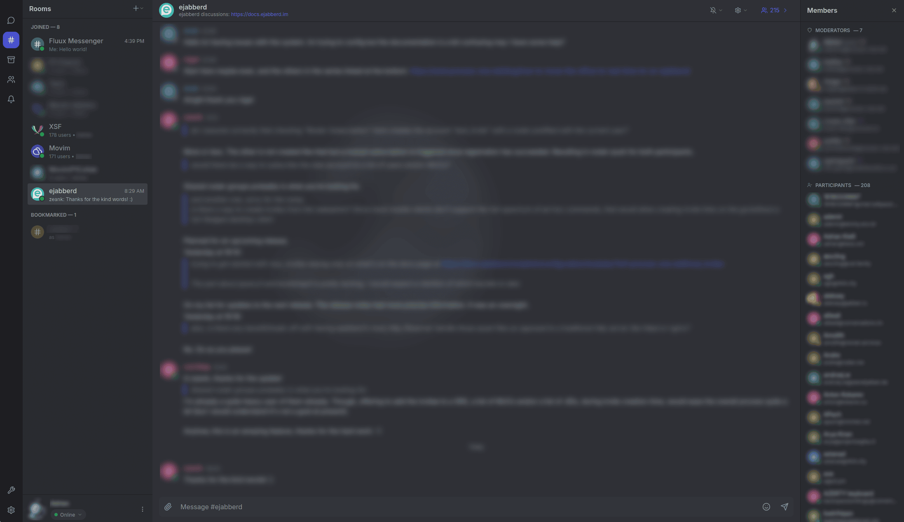
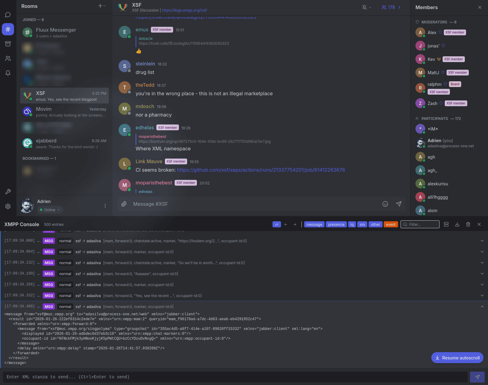
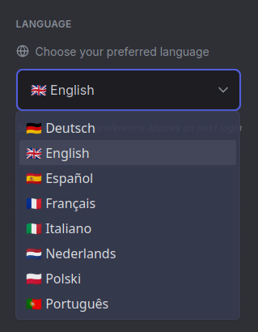
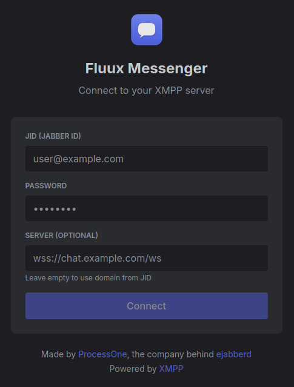
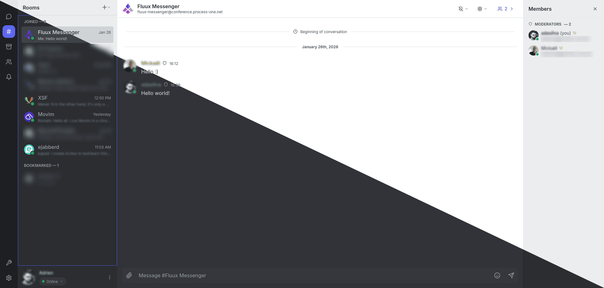
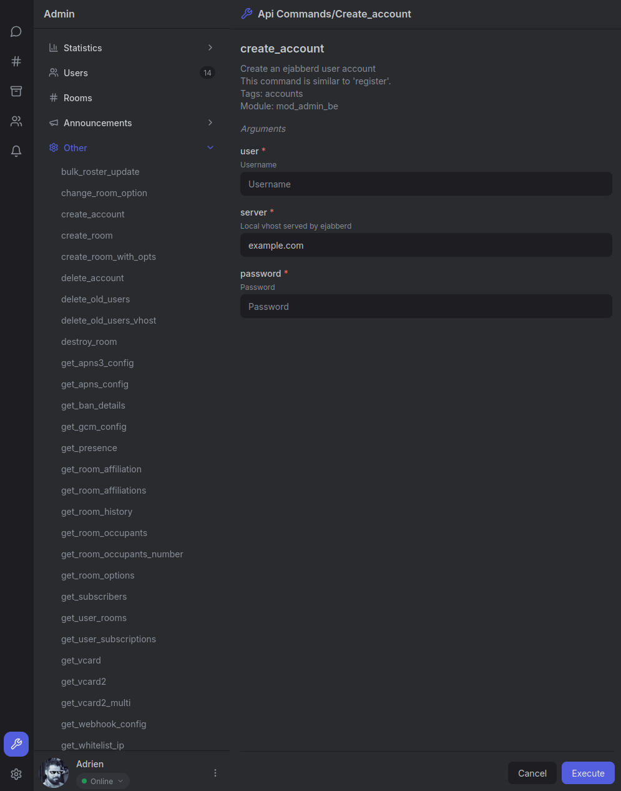
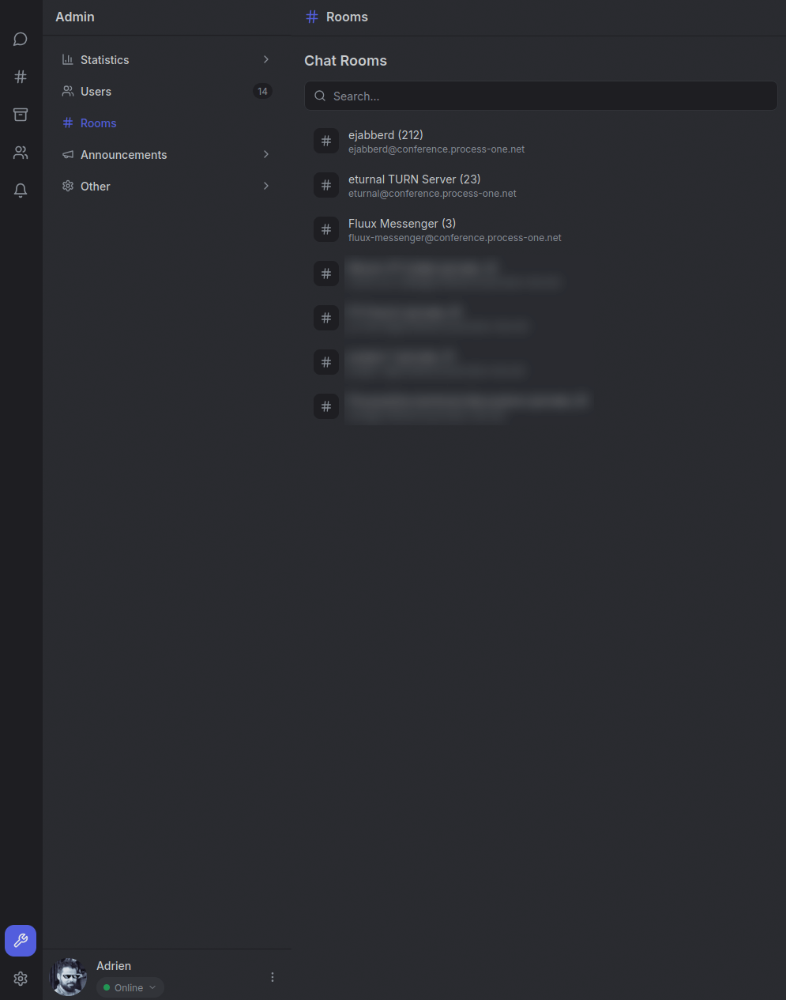
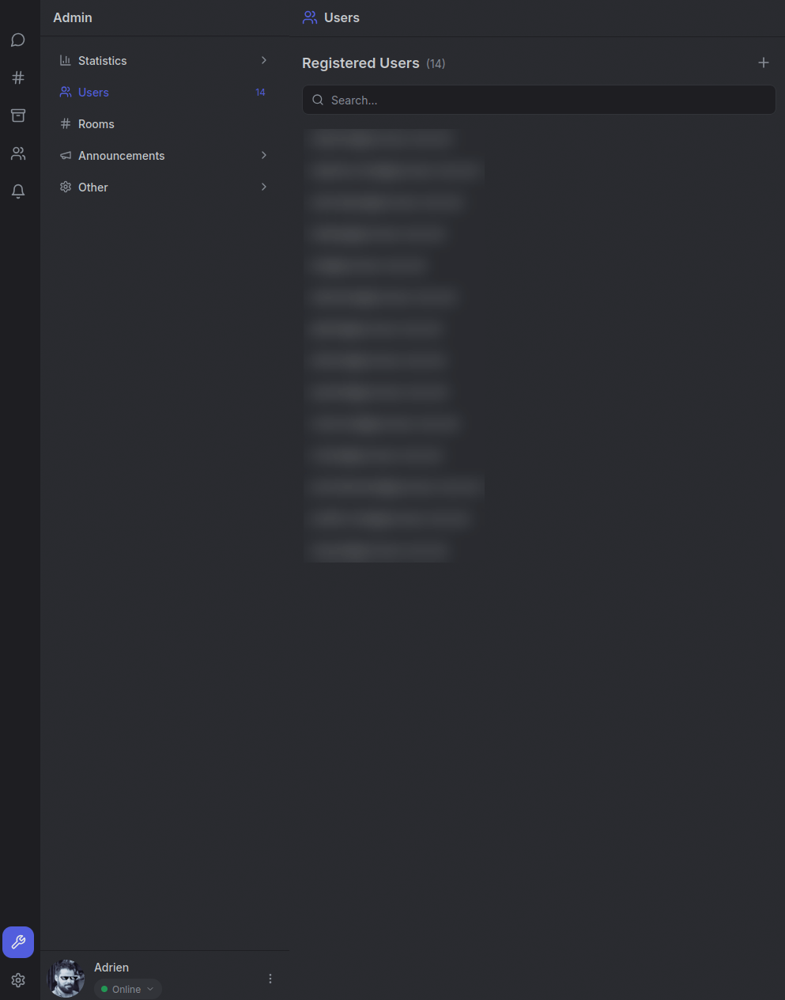

# Fluux Messenger

*A modern, cross-platform XMPP client for communities and organizations*

## Table of Contents

- [Screenshots](#-screenshots)
- [Features](#-features)
- [Quick Start](#-quick-start)
- [Technology Stack](#-technology-stack)
- [Support & Community](#-support-and-community)
- [Frequently Asked Questions](#-frequently-asked-questions)
- [Contributing](#-contributing)
- [License](#-license)
- [Star History](#-star-history)

## Screenshots

*Click on any screenshot to view full size*

| Chat Room | XMPP Console |
|-----------|--------------|
|  |  |
| *Multi-user Chat* | *XMPP Debug Interface* |

| Language Settings | Login Screen | Theme System |
|-------------------|---|-------------|
|  |  |  |
| *31 languages including all EU official languages* | *Simple Login Interface* | *Light and dark themes, more to come* |

| Admin Server Commands | Chat Rooms Management | Users Management |
|----------------------|-----------------------|------------------|
|  |  |  |
| *Manage your server right from your client* | *Moderate your rooms easily* | *User management in your client* |

## Features

- **Modern XMPP Client** - React-based UI with TypeScript
- **Cross-platform** - Available on web and desktop (Tauri-based)
- **Extensive XMPP Protocol Support** - 40+ XEPs implemented, including MAM, MUC, HTTP File Upload, message carbons, and reactions (and more to come)
- **Built-in XMPP Console** - Debug interface for developers and power users
- **Multi-user Chat** - Complete MUC support with roles, affiliations, @mentions, and bookmarks
- **File Sharing** - HTTP uploads with thumbnails, progress indicators, and previews
- **Real-time Messaging** - Typing indicators, message corrections, and delivery features
- **Offline Support** - IndexedDB storage with automatic sync on reconnect
- **Theme System** - Light/dark themes synchronized across devices
- **Internationalization** - 31 languages including complete EU coverage (Belarusian, Bulgarian, Catalan, Chinese (Simplified), Croatian, Czech, Danish, Dutch, English, Estonian, Finnish, French, German, Greek, Hungarian, Icelandic, Irish, Italian, Latvian, Lithuanian, Maltese, Norwegian, Polish, Portuguese, Romanian, Russian, Slovak, Slovenian, Spanish, Swedish, Ukrainian)
- **Self-hostable** - Connect to any XMPP server, no vendor lock-in
- **Open Source** - AGPL-3.0 licensed

## Quick Start

Get started with Fluux Messenger in a few simple steps:

1. **Download** the latest release for your platform from the [releases page](https://github.com/processone/fluux-messenger/releases/latest). Compatible with **Windows**, **macOS** and **Linux** - choose your preferred format (installer, portable, or package).

2. **Install** the application following your platform's standard installation process.

3. **Connect** to any XMPP server with your credentials and start chatting!

Need help? Check out our [support options](#-support-and-community) below.

## Technology Stack

- **Frontend**: React 18 + TypeScript
- **Desktop**: Tauri 2.x (Rust-based, lightweight)
- **Styling**: Tailwind CSS
- **State Management**: Zustand + XState
- **Build System**: Vite + Vitest
- **XMPP**: @xmpp/client + @fluux/sdk
- **Storage**: IndexedDB with idb

## Support and Community

We have many ideas and exciting additions planned for Fluux Messenger! We welcome all questions, feedback, and bug reports.  

- **GitHub Issues** - Use [Issues](https://github.com/processone/fluux-messenger/issues) to report bugs, request features, or track tasks. We use Issues as our lightweight roadmap for upcoming improvements and are always open to new ideas - don't hesitate to propose yours!  
- **GitHub Discussions** - Use [Discussions](https://github.com/processone/fluux-messenger/discussions) for questions, ideas, or general conversations that don't require formal tracking. Great for brainstorming, getting help without opening an Issue, or suggesting documentation improvements.  
- **XMPP Chatroom** - Join [fluux-messenger@conference.process-one.net](xmpp:fluux-messenger@conference.process-one.net?join) for live chat with the community and maintainers.

## Frequently Asked Questions

*Have suggestions for this FAQ? Feel free to ask questions or propose additions in our [Q&A Discussions](https://github.com/processone/fluux-messenger/discussions/categories/q-a).*

### Which XMPP servers are compatible with Fluux Messenger?

We aim to create an XMPP client that respects standards, but currently the project has been tested **exclusively with [ejabberd](https://github.com/processone/ejabberd)**. We're eager to receive feedback on compatibility with other servers. If you test Fluux Messenger with a different XMPP server, please share your experience in the [Discussions](https://github.com/processone/fluux-messenger/discussions)!

### Will there be other installations methods? Can I run it on my own server?

Yes. It is already technically possible to host Fluux Messenger on your own web server. After running a quick `npm ci` in the appropriate directory and serving the correct build folder, you can access it as a web application. This also makes it possible to run it as a PWA, including on mobile devices, directly from your own server. Documentation for this setup is still missing and will be added later.

Looking ahead, we also plan to make Fluux Messenger available on F-Droid, and possibly on the Google Play Store as well.

## Contributing

Contributions are welcome! See [CONTRIBUTING](CONTRIBUTING.md) for detailed guidelines.

For getting started with development, you can check out our [Developer Guide](docs/DEVELOPER.md).

## License

Fluux Messenger is licensed under the **GNU Affero General Public License v3.0 or later**. See [LICENSE](LICENSE)

## Star History

---

**Built with ❤️ by [ProcessOne](https://github.com/processone).**

