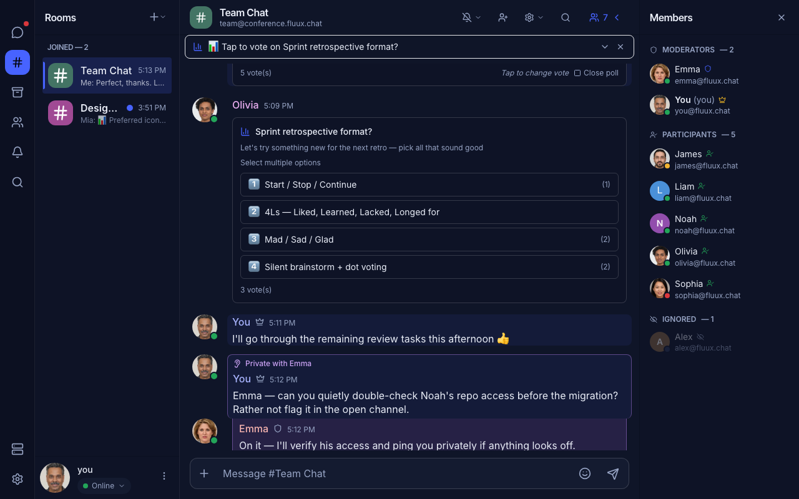
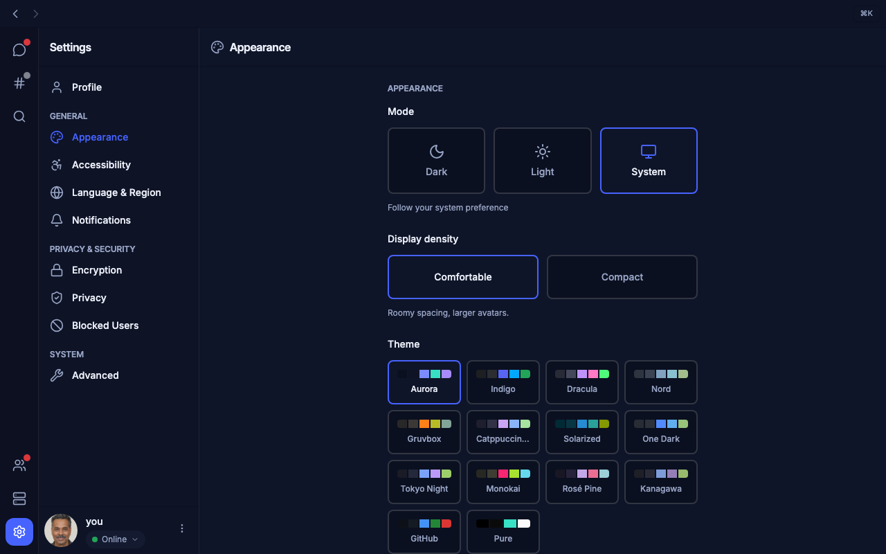

# Fluux Messenger

*A modern, cross-platform XMPP client for communities and organizations*

## Table of Contents

- [Screenshots](#screenshots)
- [Features](#features)
- [Quick Start](#quick-start)
- [Technology Stack](#technology-stack)
- [Support & Community](#support-and-community)
- [Frequently Asked Questions](#frequently-asked-questions)
- [Contributing](#contributing)
- [License](#license)
- [Star History](#star-history)

## Screenshots

*Light and dark modes side by side*

| Group Chat | Themes & Customization |
|------------|----------------------|
|  |  |
| *Multi-user chat with roles, reactions, and polls* | *14 built-in themes, custom accents, and font settings* |

[See all screenshots in the visual overview](screenshots/OVERVIEW.md)

## Features

### Rich Messaging
- **Reactions, Replies & Styling** - Emoji reactions with quick toolbar, threaded replies, and rich text formatting (bold, italic, code blocks with syntax highlighting)
- **Message Retraction & Moderation** - Delete your own messages or moderate room messages with full audit trail
- **Link Previews** - Automatic Open Graph previews for shared URLs
- **File Sharing** - HTTP uploads with drag-and-drop, thumbnails, progress indicators, image lightbox, and text file preview
- **Polls** - Create polls in rooms with emoji voting, deadlines, single or multi-vote modes, and live result tallies

### Group Chat & Collaboration
- **Multi-user Chat** - Complete MUC support with roles, affiliations, custom hats (role badges), @mentions, and bookmarks
- **Private Messages in Rooms** - Mediated private messages (whispers, XEP-0045 §7.5) to a single occupant, shown as a distinct private thread you can reply to privately
- **Quick Chat** - Instantly create ad-hoc group conversations and invite contacts by name
- **Per-User Ignore** - Mute specific users per room, synced across devices
- **Activity Log** - Persistent feed of events: invitations, subscription requests, reactions, poll votes, joins and leaves

### Powerful Search
- **Full-text Search** - Instant offline search powered by an IndexedDB inverted index, supplemented by live server archive queries
- **Find on Page** - Cmd/Ctrl+F to search within the current conversation with highlight and scroll
- **Smart Filters** - Type filter pills, `in:` prefix autocomplete, quoted exact-phrase matching, and keyboard-navigable results with context preview

### Theming & Personalization
- **14 Built-in Themes** - Catppuccin, Nord, Dracula, Gruvbox, Tokyo Night, Rosé Pine, Solarized, and more — plus light/dark mode
- **Custom Themes** - Import/export themes as JSON, pick a custom accent color, or write CSS overrides in the built-in editor
- **Synced Across Devices** - Theme, accent, and font size preferences are stored server-side and follow you everywhere
- **Internationalization** - 31 languages including complete EU coverage

### Privacy & Security
- **Self-hostable** - Connect to any XMPP server, no vendor lock-in, no third-party dependency
- **End-to-End Encryption** - OpenPGP (OX-IM) for 1:1 and group chats; automatic key discovery, peer verification, and cross-device verification sync
- **FAST Authentication** - Modern SASL2 with token-based reconnection for instant, password-less session resumption
- **Contact Blocking** - Full block/unblock support with a dedicated management screen
- **In-Band Password Change** - Change your account password without leaving the app

### Desktop & Cross-Platform
- **Cross-platform** - Available on the web, macOS (Intel & Apple Silicon), Windows, and Linux (deb, rpm, flatpak, AUR)
- **Auto Updates** - Built-in update checker with release notes and one-click install (desktop)
- **Native Notifications** - Desktop notifications with click-to-focus; web push notifications even when the tab is closed
- **Auto-Away** - Automatically sets your status to away on system idle and restores it on activity
- **Offline Support** - IndexedDB storage with automatic sync and stream management session resumption on reconnect

### Power User Tools
- **Command Palette** - Keyboard-accessible launcher for conversations, contacts, rooms, and actions
- **Keyboard Shortcuts** - Comprehensive shortcut system with a categorized help overlay and AZERTY support
- **Built-in XMPP Console** - Live stanza inspector and debug interface
- **Server Administration** - Manage users, rooms, and server commands right from the client (for admins)
- **User Profiles** - Rich user info popovers with vCard details, connected devices, timezone, and last seen status

### Developer-Friendly
- **Headless SDK** - Reusable `@fluux/sdk` package for building custom XMPP clients or bots
- **50+ XEPs Implemented** - MAM, MUC, Stream Management, Message Carbons, HTTP File Upload, Reactions, OpenPGP (OX-IM), FAST, and [many more](./SUPPORTED_XEPS.md).
- **Compatible** - see [Compliance of Fluux](https://xmpp.org/software/fluux-messenger/).
- **Open Source** - AGPL-3.0 licensed

## Quick Start

Get started with Fluux Messenger in a few simple steps:

> **Want to try it first?** Head over to [demo.fluux.io](https://demo.fluux.io) for an instant live demo, no installation needed.

1. **Download** the latest release for your platform from the [releases page](https://github.com/processone/fluux-messenger/releases/latest).

2. **Install** using the instructions for your platform below.

3. **Connect** to any XMPP server with your credentials and start chatting!

<b>Windows (x64)</b>

| Format | How to install                                                                |
|--------|-------------------------------------------------------------------------------|
| `.exe` | Run the setup wizard (recommended)                                            |
| `.msi` | Run `msiexec /i Fluux-Messenger_*_Windows_x64.msi` or double-click to install |

<b>macOS (Intel & Apple Silicon)</b>

| Format        | How to install                                                                |
|---------------|-------------------------------------------------------------------------------|
| `.dmg`        | Open the image and drag **Fluux Messenger** to **Applications** (recommended) |
| `.app.tar.gz` | Extract with `tar xzf` and move the `.app` to **Applications**                |

Both `x64` (Intel) and `arm64` (Apple Silicon) builds are available.

<b>Linux (x64 & arm64)</b>

| Format     | How to install                                                  |
|------------|-----------------------------------------------------------------|
| `.deb`     | `sudo dpkg -i Fluux-Messenger_*.deb` (Debian, Ubuntu, Mint...)  |
| `.rpm`     | `sudo rpm -i Fluux-Messenger_*.rpm` (Fedora, RHEL, openSUSE...) |
| `.flatpak` | `flatpak install Fluux-Messenger_*.flatpak`                     |
| `.tar.gz`  | Extract with `tar xzf` and run the binary directly              |

Both `x64` and `arm64` builds are available for all formats.

**Arch Linux** users can install from the AUR: [`fluux-messenger`](https://aur.archlinux.org/packages/fluux-messenger)

<b>Web (self-hosted)</b>

Download the `fluux-messenger-*-web.zip` asset from the [releases page](https://github.com/processone/fluux-messenger/releases/latest), extract it, and serve it with any web server of your choice (app must be served over HTTP). This also works as a PWA on mobile devices when served from your own domain.

<b>Build from source</b>

See the [Developer Guide](docs/DEVELOPER.md) for instructions on building and running Fluux Messenger locally.

Need help? Check out our [support options](#support-and-community) below.

## Technology Stack

- **Frontend**: React 18 + TypeScript
- **Desktop**: Tauri 2.x (Rust-based, lightweight)
- **Styling**: Tailwind CSS
- **State Management**: Zustand + XState
- **Build System**: Vite + Vitest
- **XMPP**: @xmpp/client + @fluux/sdk
- **Storage**: IndexedDB with idb

## Support and Community

We have many ideas and exciting additions planned for Fluux Messenger! We welcome all questions, feedback, and bug reports.  

- **GitHub Issues** - Use [Issues](https://github.com/processone/fluux-messenger/issues) to report bugs, request features, or track tasks. We use Issues as our lightweight roadmap for upcoming improvements and are always open to new ideas - don't hesitate to propose yours!  
- **GitHub Discussions** - Use [Discussions](https://github.com/processone/fluux-messenger/discussions) for questions, ideas, or general conversations that don't require formal tracking. Great for brainstorming, getting help without opening an Issue, or suggesting documentation improvements.  
- **XMPP Chatroom** - Join [fluux-messenger@conference.process-one.net](xmpp:fluux-messenger@conference.process-one.net?join) for live chat with the community and maintainers.

## Frequently Asked Questions

*Have suggestions for this FAQ? Feel free to ask questions or propose additions in our [Q&A Discussions](https://github.com/processone/fluux-messenger/discussions/categories/q-a).*

### Installation & Compatibility

#### Which XMPP servers are compatible with Fluux Messenger?

We aim to create an XMPP client that respects standards, but currently the project has been tested **exclusively with [ejabberd](https://github.com/processone/ejabberd)**. We're eager to receive feedback on compatibility with other servers.

#### Will there be other installations methods? Can I run it on my own server?

Yes. A pre-built static web bundle (`-web.zip`) is available on the [releases page](https://github.com/processone/fluux-messenger/releases/latest). Simply extract it and serve it with any web server.

Looking ahead, we also plan to make Fluux Messenger available on F-Droid, and possibly on the Google Play Store as well.

#### My XMPP server only listens on the standard TCP port (5222), can I still use Fluux Messenger?

Yes, on the **desktop** app: it ships with a built-in WebSocket-to-TCP proxy. It first tries WebSocket (via [XEP-0156](https://xmpp.org/extensions/xep-0156.html) discovery), then falls back to TCP/TLS.

The **web** version requires WebSocket on your server, with [CORS](https://developer.mozilla.org/en-US/docs/Web/HTTP/CORS) configured to allow the origin from which Fluux is served.

### Features & Roadmap

#### Does Fluux Messenger support end-to-end encryption?

Yes — **OpenPGP (OX-IM, XEP-0373/0374)** is fully implemented. Messages in 1:1 and group chats are encrypted and signed using each participant's published OpenPGP key. Features include automatic key discovery, peer verification with cross-device sync, secret key backup, and MAM history decryption. **OMEMO** may follow: beyond the implementation work it raises licensing questions we want to address properly. We're also watching **MLS** as an option for large-scale group chats.

#### When will voice and video calls be available?

We know it's important and we want to bring it. We can't commit to a timeline yet: there's real work to do on both the client and server side, especially for group calls which need a media-mixing SFU to be reliable.

#### Does Fluux Messenger support read receipts?

Not yet. Read receipts are on our list and we plan to start with 1-to-1 chats. For group rooms we're still weighing the question: how useful they actually are at scale, how best to implement them and the privacy implications of broadcasting read state to every participant.

#### Does Fluux Messenger support Spaces (bundles of rooms)?

Not yet. Spaces ([XEP-0503](https://xmpp.org/extensions/xep-0503.html)) have started to appear in the ecosystem (Movim has an experimental implementation) and we're watching how it evolves before committing to an approach.

#### Can I contribute a translation for my language?

Yes, translations are welcome. Locale files live under `apps/fluux/src/i18n/locales/`. See [CONTRIBUTING.md](CONTRIBUTING.md) for the general contribution workflow. Feel free to open an issue or discussion first if you have questions.

#### Is there a roadmap?

There's no formal roadmap document, but we track upcoming work through GitHub [Milestones](https://github.com/processone/fluux-messenger/milestones) and [Issues](https://github.com/processone/fluux-messenger/issues). Feel free to follow, comment or open a new issue for anything you'd like to see.

### Troubleshooting

#### My antivirus flags the Windows installer as malicious, is the app safe?

Yes. Two things can trigger warnings right now:

- Starting with 0.15, the Windows binary is temporarily **not code-signed** while we work through the signing infrastructure (see [#290](https://github.com/processone/fluux-messenger/issues/290)).
- The combination of [Tauri](https://tauri.app/) and [NSIS](https://nsis.sourceforge.io/) used to package the app is also a known source of antivirus false positives affecting many legitimate apps.

If you'd rather verify for yourself, you can always [build the app from source](docs/DEVELOPER.md).

#### Closing the window doesn't quit the app, is that normal?

Yes. By default, closing the main window minimizes Fluux to the system tray or menu bar so it can keep your XMPP session alive and deliver notifications. To fully exit, use the **Quit** entry from the tray menu.

#### On the web version, why do I have to log in again after closing the tab?

For security, credentials are only kept in the session context. Nothing sensitive is persisted to local storage. If your XMPP server supports [FAST](https://xmpp.org/extensions/xep-0484.html) authentication tokens (SASL2), reconnection across page reloads will work seamlessly, without ever storing your password. If it doesn't, your server likely doesn't yet support FAST.

## Contributing

Contributions are welcome! See [CONTRIBUTING](CONTRIBUTING.md) for detailed guidelines.

For getting started with development, you can check out our [Developer Guide](docs/DEVELOPER.md).

## License

Fluux Messenger is licensed under the **GNU Affero General Public License v3.0 or later**. See [LICENSE](LICENSE)

## Star History

---

**Built with ❤️ by [ProcessOne](https://github.com/processone).**

