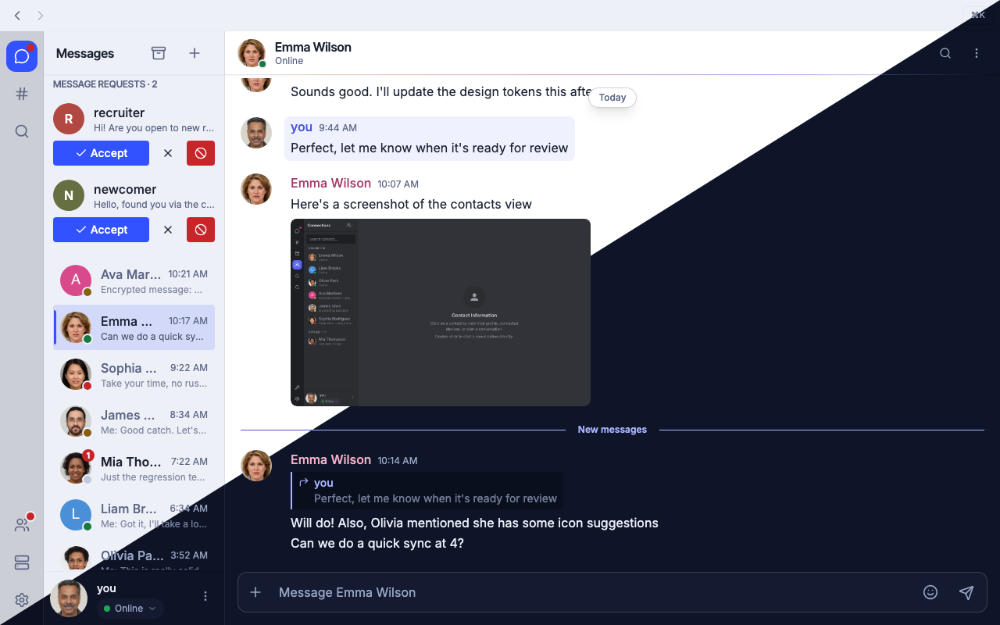
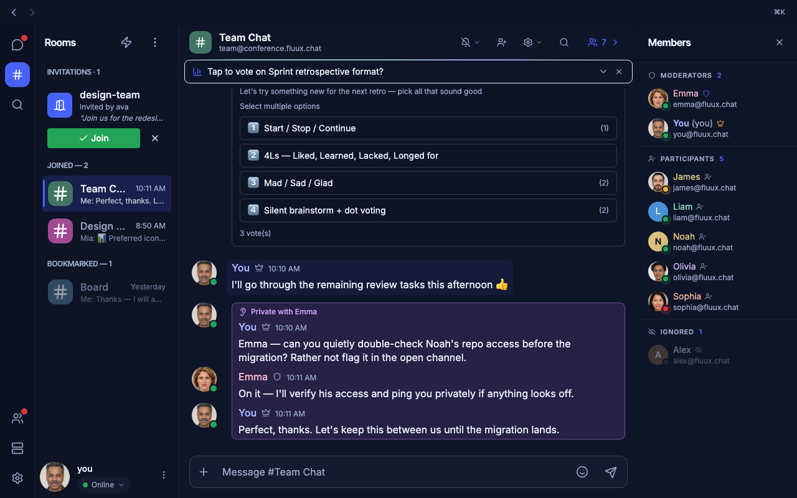
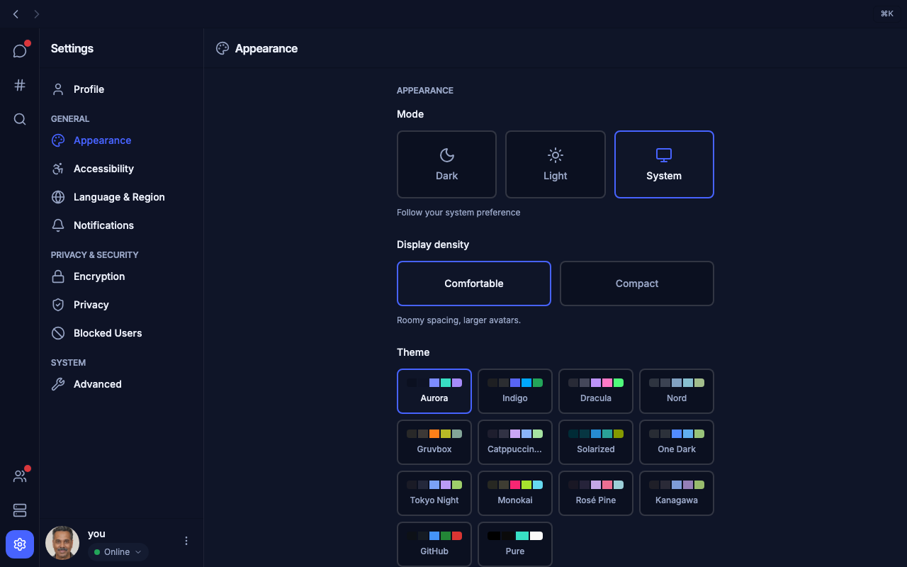

# Fluux Messenger

*A modern, cross-platform XMPP client for communities and organizations*

<video src="https://github.com/user-attachments/assets/167cc825-234c-4f0c-aa58-1bd3e8aa2737" controls muted width="760"></video>

*A quick tour: messaging, group rooms, end-to-end encryption, and theming.*

## Table of Contents

- [Screenshots](#screenshots)
- [Features](#features)
- [Quick Start](#quick-start)
- [Command-Line Options](#command-line-options)
- [Technology Stack](#technology-stack)
- [Support & Community](#support-and-community)
- [Frequently Asked Questions](#frequently-asked-questions)
- [Contributing](#contributing)
- [License](#license)
- [Star History](#star-history)

## Screenshots

*Light and dark modes side by side*

| Group Chat | Themes & Customization |
|------------|----------------------|
|  |  |
| *Multi-user chat with roles, reactions, and polls* | *14 built-in themes, custom accents, and font settings* |

[See all screenshots in the visual overview](screenshots/OVERVIEW.md)

## Features

### Messaging
- **Reactions, Replies & Styling** - Emoji reactions with quick toolbar, threaded replies, and rich text formatting (bold, italic, code blocks with syntax highlighting). On touch screens, long-press a reaction chip to see names and avatars in a bottom sheet, starting on that emoji, with a tab for each emoji. You can also choose **Reactions** from the message's long-press menu. A short tap still toggles your own reaction; desktop hover tooltips remain available. Room reactors are shown by occupant nickname.
- **Emoji Autocomplete** - Type `:` and a keyword to complete emojis inline, with arrow-key navigation and Enter or Tab to insert
- **Direct-chat History** - Messages remain separate when a sender reuses a message ID and the archive distinguishes them. See [message identity and targeting limits](docs/MESSAGE_IDENTIFIERS.md#4-a-row-is-not-a-message) for remaining edge cases.
- **Message Retraction & Moderation** - Delete your own messages or remove room messages for all participants. Connected moderators can open **Bulk moderation** from the room management menu, filter by sender or message text, select messages, then **Review selection** before removal. The single-message removal dialog also offers **Review messages from…** when a stable author identity is available; a reused nickname does not identify the same author.

  Each batch contains only messages already loaded when its dialog opened. To include older messages, close the dialog, scroll back in the room, then reopen it. Messages with uncertain IDs from an older local cache remain readable, but individual and bulk moderator removal are unavailable until normal loading confirms their room-assigned IDs. Moderation does not fetch history to verify them, scan the full archive, or purge the server database.

  Requests run sequentially with a pause between them and recheck connection and permissions. **Stop after current message** leaves later requests unattempted. Results count removals, failures, skips and unattempted messages; **Retry** reviews failures and unattempted messages without resending successful removals.

  Both removal dialogs offer a translated **Spam** preset that sends the reason `Spam`. Fluux hides the entire row and its previews when trusted room moderation carries that reason, ignoring case and surrounding whitespace; other removals retain a deletion notice. Known Spam quotations also disappear from replies and search context. A staged reply loses the hidden quotation while preserving your draft text and attachment, including during upload. Local cache checks for these previews do not fetch server history. **Load earlier messages** and keyboard history navigation remain available when every loaded row is hidden.

- **Link Previews** - Automatic Open Graph previews for shared URLs, including previews received while a chat or room is inactive or opening
- **File Sharing** - HTTP uploads with drag-and-drop, thumbnails, progress indicators, image lightbox, and text file preview
- **Polls** - Create polls in rooms with emoji voting, deadlines, single or multi-vote modes, and live result tallies

### Group Chat & Collaboration
- **Multi-user Chat** - Complete MUC support with roles, affiliations, custom hats (role badges), @mentions, and bookmarks
- **Room Unread Badges** - Joined rooms show their total unread count over the avatar, like direct chats. The badge is grey for ordinary unread activity and uses the attention colour for mentions or notify-all rooms; muted rooms keep a grey unread badge. The separate `@N` marker shows mentions. Room tooltips show room status, or occupants and your nickname, without repeating unread counts.
- **Nickname Mentions** - Room mentions such as `@James` and `james:` match the person's name color even when typed in another letter case; mentions of you use your own-name color. Matching uses identities learned from occupants and loaded messages while viewing that room, remembered for the current app session after people leave or you switch rooms. An author not yet seen in that view may use a JID or nickname color until their messages load. If someone else takes a nickname, mentions follow its current holder.
- **Permission to Speak** - In moderated rooms, visitors choose **Request voice** in place of the public message composer. Room moderators review **Voice requests** and choose **Grant voice** or **Dismiss**. Visitors can request voice again after an unanswered request or an error; the button is disabled while offline or sending. Public messaging becomes available only when the server grants permission. Dismissing a request only removes it locally; whisper permissions remain governed by the room's existing private-message policy.
- **Private Messages in Rooms** - Mediated private messages (whispers, XEP-0045 §7.5) to a single occupant, shown as a distinct private thread you can reply to privately. Choose **Whisper** from a member's right-click or long-press menu. On mobile, this closes the member list and focuses the whisper composer. Long-pressing member, contact, conversation, and room rows opens their menus without selecting the row text.
- **Quick Chat** - Instantly create ad-hoc group conversations and invite contacts by name
- **Per-User Ignore** - Mute specific users per room, synced across devices

  Messages from ignored users, and replies hidden by the same ignore filter, do not add unread or mention/alert counts when they arrive. Changing the ignore list requests a filtered recount in rooms with server archive support (MAM), once history and local cache writes are ready. A recount that finds no visible unread messages clears both badges; if visible unread messages remain, it preserves the existing mention/alert count.

  In rooms without MAM and in Quick Chats, ignoring someone leaves existing counts until the room is read. Ignore/unignore cycles do not reconstruct past mention/alert counts, and messages excluded on arrival are not guaranteed to reappear in unread counts without an archive recount.

- **Activity Log** - Persistent feed of events: invitations, subscription requests, reactions, poll votes, joins and leaves

### Search
- **Full-text Search** - Instant offline search powered by an IndexedDB inverted index, supplemented by live server archive queries
- **Go to Message** - Open a search result's conversation at the exact matched message, including deep in history. A brief highlight marks the target, with a steady background under reduced motion. The button stays visible on touch devices.
- **Find on Page** - Cmd/Ctrl+F to search within the current conversation with highlight and scroll
- **Smart Filters** - Type filter pills, `in:` prefix autocomplete, quoted exact-phrase matching, and keyboard-navigable results with context preview

### Theming & Personalization
- **14 Built-in Themes** - Catppuccin, Nord, Dracula, Gruvbox, Tokyo Night, Rosé Pine, Solarized and more, in light and dark mode
- **Custom Themes** - Import/export themes as JSON, pick a custom accent color, or write CSS overrides in the built-in editor
- **Synced Across Devices** - Theme, accent, and font size preferences are stored server-side and follow you everywhere
- **Internationalization** - 34 languages including complete EU coverage

### Privacy & Security
- **Self-hostable** - Connect to any XMPP server, no vendor lock-in, no third-party dependency
- **End-to-End Encryption** - OpenPGP (OX-IM, XEP-0373/0374) for 1:1 chats; messages are encrypted and signed; automatic key discovery, peer verification with cross-device sync, secret key backup, and encrypted MAM history decryption
- **FAST Authentication** - Modern SASL2 with token-based reconnection for instant, password-less session resumption
- **Contact Blocking** - Full block/unblock support with a dedicated management screen
- **In-Band Password Change** - Change your account password without leaving the app

### Desktop & Cross-Platform
- **Cross-platform** - Available on the web, macOS (Intel & Apple Silicon), Windows, and Linux (deb, rpm, flatpak, AUR)
- **Auto Updates** - Built-in update checker with release notes and one-click install (desktop)
- **Native Notifications** - Desktop notifications with click-to-focus; web push notifications even when the tab is closed. On iOS, remote message notifications can show cached contact and room avatars; [OpenPGP notification previews](docs/IOS_DEVELOPMENT.md#openpgp-notification-previews) are available as a per-account opt-in. Contact requests, room invitations, and voice requests raise actionable alerts that respect Do Not Disturb and open the relevant request or room.
- **Auto-Away** - Automatically sets your status to away on system idle and restores it on activity
- **Offline Support** - IndexedDB storage with automatic sync and stream management session resumption on reconnect

### Power User Tools
- **Command Palette** - Cmd/Ctrl+K opens a launcher for conversations, contacts, rooms, and actions. Search by contact name or username, including the currently open conversation; it stays hidden from empty-query suggestions.
- **Keyboard Shortcuts** - Shortcuts for navigation and message actions, with a categorized help overlay and AZERTY support
- **Built-in XMPP Console** - Live stanza inspector with exportable connection-health diagnostics for scheduler suspension, sleep, reconnection, and deferred unread-badge updates
- **Server Administration** - Manage users, rooms, and server commands right from the client (for admins)
- **User Profiles** - User info popovers with vCard details, connected devices, timezone, and last seen status

### Developer-Friendly
- **Headless SDK** - Reusable `@fluux/sdk` package for building custom XMPP clients or bots
- **50+ XEPs Implemented** - MAM, MUC, Stream Management, Message Carbons, HTTP File Upload, Reactions, OpenPGP (OX-IM), FAST, and [many more](./SUPPORTED_XEPS.md).
- **Compatible** - see [Compliance of Fluux](https://xmpp.org/software/fluux-messenger/).
- **Open Source** - AGPL-3.0 licensed

## Quick Start

> **Want to try it first?** Head over to [demo.fluux.io](https://demo.fluux.io) for a live demo, no installation needed.

1. **Download** the latest release for your platform from the [releases page](https://github.com/processone/fluux-messenger/releases/latest).

2. **Install** using the instructions for your platform below.

3. **Connect** to any XMPP server with your credentials and start chatting!

<b>Windows (x64)</b>

| Format | How to install                                                                |
|--------|-------------------------------------------------------------------------------|
| `.exe` | Run the setup wizard (recommended)                                            |
| `.msi` | Run `msiexec /i Fluux-Messenger_*_Windows_x64.msi` or double-click to install |

See [Windows title bar](docs/APP_BAR.md#windows-the-bar-is-the-title-bar) for
window controls, shortcuts, and the Snap Layouts hover limitation.

<b>macOS (Intel & Apple Silicon)</b>

| Format        | How to install                                                                |
|---------------|-------------------------------------------------------------------------------|
| `.dmg`        | Open the image and drag **Fluux Messenger** to **Applications** (recommended) |
| `.app.tar.gz` | Extract with `tar xzf` and move the `.app` to **Applications**                |

Both `x64` (Intel) and `arm64` (Apple Silicon) builds are available.

<b>Linux (x64 & arm64)</b>

| Format     | How to install                                                  |
|------------|-----------------------------------------------------------------|
| `.deb`     | `sudo dpkg -i Fluux-Messenger_*.deb` (Debian, Ubuntu, Mint...)  |
| `.rpm`     | `sudo rpm -i Fluux-Messenger_*.rpm` (Fedora, RHEL, openSUSE...) |
| `.flatpak` | `flatpak install Fluux-Messenger_*.flatpak`                     |
| `.tar.gz`  | Extract with `tar xzf` and run the binary directly              |

Both `x64` and `arm64` builds are available for all formats.

**Arch Linux** users can install from the AUR: [`fluux-messenger`](https://aur.archlinux.org/packages/fluux-messenger)

<b>Web (self-hosted)</b>

Download the `fluux-messenger-*-web.zip` asset from the [releases page](https://github.com/processone/fluux-messenger/releases/latest), extract it, and serve it with any web server (the app must be served over HTTP). This also works as a PWA on mobile devices when served from your own domain.

<b>Build from source</b>

See the [Developer Guide](docs/DEVELOPER.md) for instructions on building and running Fluux Messenger locally.
For experimental mobile builds, see [Android development](docs/ANDROID_DEVELOPMENT.md) and [iOS development](docs/IOS_DEVELOPMENT.md).

Need help? See the [support options](#support-and-community) below.

## Command-Line Options

The desktop app accepts a few command-line flags. Run `fluux-messenger --help` to list them:

| Flag | Description |
|------|-------------|
| `-v`, `--verbose` | Enable verbose logging to stderr (no XMPP traffic) |
| `--verbose=xmpp` | Enable verbose logging including XMPP packet content |
| `--log-file=PATH` | Override the log file directory (default: platform log dir) |
| `-c`, `--clear-storage` | Clear local storage (localStorage, sessionStorage, IndexedDB) on startup |
| `--dangerous-insecure-tls` | Disable TLS certificate verification. **Insecure**, for development and testing only. |
| `-h`, `--help` | Show the help message |

> **Warning:** `--dangerous-insecure-tls` turns off TLS certificate validation for the connection to your XMPP server, which exposes it to man-in-the-middle attacks. Use it only for local development or testing (for example, against a server with a self-signed certificate), never in production.

## Technology Stack

- **Frontend**: React 18 + TypeScript
- **Desktop**: Tauri 2.x (Rust-based, lightweight)
- **Styling**: Tailwind CSS
- **State Management**: Zustand + XState
- **Build System**: Vite + Vitest
- **XMPP**: @xmpp/client + @fluux/sdk
- **Storage**: IndexedDB with idb

## Support and Community

We have a lot planned for Fluux Messenger, and we welcome questions, feedback, and bug reports.  

- **GitHub Issues** - Use [Issues](https://github.com/processone/fluux-messenger/issues) to report bugs, request features, or track tasks. We use Issues as our lightweight roadmap for upcoming improvements, and we're open to new ideas, so tell us about yours.  
- **GitHub Discussions** - Use [Discussions](https://github.com/processone/fluux-messenger/discussions) for questions, ideas, or general conversations that don't require formal tracking. Great for brainstorming, getting help without opening an Issue, or suggesting documentation improvements.  
- **XMPP Chatroom** - Join [fluux-messenger@conference.process-one.net](xmpp:fluux-messenger@conference.process-one.net?join) for live chat with the community and maintainers.

## Frequently Asked Questions

*Have suggestions for this FAQ? Ask questions or propose additions in our [Q&A Discussions](https://github.com/processone/fluux-messenger/discussions/categories/q-a).*

### Installation & Compatibility

#### Which XMPP servers are compatible with Fluux Messenger?

We aim to create an XMPP client that respects standards, but currently the project has been tested **exclusively with [ejabberd](https://github.com/processone/ejabberd)**. We're eager to receive feedback on compatibility with other servers.

#### Will there be other installations methods? Can I run it on my own server?

Yes. A pre-built static web bundle (`-web.zip`) is available on the [releases page](https://github.com/processone/fluux-messenger/releases/latest). Extract it and serve it with any web server.

We also plan to publish Fluux Messenger on F-Droid, and possibly on the Google Play Store.

#### My XMPP server only listens on the standard TCP port (5222), can I still use Fluux Messenger?

Yes. See [Connection Schemes](docs/CONNECTION.md) for native TCP/TLS support by platform, WebSocket requirements, and diagnosing connection failures.

#### Encrypted attachments don't open or preview in the web version

The web version downloads each encrypted attachment and decrypts it in the browser before displaying it, so the host serving your uploaded files (HTTP File Upload) must send [CORS](https://developer.mozilla.org/en-US/docs/Web/HTTP/CORS) headers allowing the origin from which Fluux is served. The desktop app downloads files through its native HTTP client, so it is not affected.

### Features & Roadmap

#### Does Fluux Messenger support end-to-end encryption?

Yes. **OpenPGP (OX-IM, XEP-0373/0374)** is implemented for one-to-one chats. Messages in 1:1 conversations are encrypted and signed using each participant's published OpenPGP key. Features include automatic key discovery, peer verification with cross-device sync, secret key backup, and MAM history decryption. Group-chat (MUC) encryption is not yet supported. **OMEMO** may follow: beyond the implementation work it raises licensing questions we want to address properly. We're also watching **MLS** as an option for large-scale group chats.

#### When will voice and video calls be available?

We know it's important and we want to bring it. We can't commit to a timeline yet: there's real work to do on both the client and server side, especially for group calls which need a media-mixing SFU to be reliable.

#### Does Fluux Messenger support read receipts?

Not yet. Read receipts are on our list and we plan to start with 1-to-1 chats. For group rooms we're still weighing the question: how useful they actually are at scale, how best to implement them and the privacy implications of broadcasting read state to every participant.

#### Does Fluux Messenger support Spaces (bundles of rooms)?

Not yet. Spaces ([XEP-0503](https://xmpp.org/extensions/xep-0503.html)) have started to appear in the ecosystem (Movim has an experimental implementation) and we're watching how it evolves before committing to an approach.

#### Can I contribute a translation for my language?

Yes, translations are welcome. Locale files live under `apps/fluux/src/i18n/locales/`. See [CONTRIBUTING.md](CONTRIBUTING.md) for the general contribution workflow. Open an issue or discussion first if you have questions.

#### Is there a roadmap?

There's no formal roadmap document, but we track upcoming work through GitHub [Milestones](https://github.com/processone/fluux-messenger/milestones) and [Issues](https://github.com/processone/fluux-messenger/issues). Follow, comment or open a new issue for anything you'd like to see.

### Troubleshooting

#### How do I turn off notification sounds?

Open **Settings → Notifications** and turn off **Play notification sounds**. The setting is saved on this device and controls both Fluux's own sounds and the sound requested with system notifications; banners can still appear when notification permission is granted. See the [Android notification limitations](docs/ANDROID_DEVELOPMENT.md#proxy-generated-configuration-and-limitations) for older Android versions.

Background Web Push uses a saved copy of this preference after the tab closes. Updating that copy is best-effort: simultaneous writes from multiple tabs or storage failures can leave it out of date. If the saved copy is missing or cannot be read, background notifications request silence. The browser and operating system ultimately control notification delivery and sound.

#### My antivirus flags the Windows installer as malicious, is the app safe?

Yes. Two things can trigger warnings right now:

- Starting with 0.15, the Windows binary is temporarily **not code-signed** while we work through the signing infrastructure (see [#290](https://github.com/processone/fluux-messenger/issues/290)).
- The combination of [Tauri](https://tauri.app/) and [NSIS](https://nsis.sourceforge.io/) used to package the app is also a known source of antivirus false positives affecting many legitimate apps.

If you'd rather verify for yourself, [build the app from source](docs/DEVELOPER.md).

#### Closing the window doesn't quit the app, is that normal?

Yes. On Windows and Linux, **Keep Fluux in the system tray** in **Settings → Notifications** is enabled by default. When a compatible tray is available, closing the main window hides Fluux there so it can keep your XMPP session alive and deliver notifications. Use **Show Fluux** in the tray menu to restore the window, or **Quit** to exit. Disable the setting if you want closing the window to quit.

Linux supports StatusNotifier trays and, when Fluux runs on X11 without a StatusNotifier watcher, XEmbed trays such as Polybar under i3. An XWayland-only tray cannot serve a native Wayland Fluux window. If no usable tray is detected or the availability check fails, closing the window quits Fluux instead of leaving it running invisibly.

On macOS, closing the window keeps Fluux running. To quit, use **Fluux Messenger → Quit Fluux Messenger** or **⌘Q**.

#### On the web version, why do I have to log in again after closing the tab?

Fluux never persists your password to local storage. If your XMPP server supports [FAST](https://xmpp.org/extensions/xep-0484.html) authentication tokens (SASL2), Fluux stores a short-lived token in local storage so reconnection across page reloads works without storing the password. Without FAST support, the session credentials disappear when the tab closes and you must log in again.

## Contributing

Contributions are welcome! See [CONTRIBUTING](CONTRIBUTING.md) for detailed guidelines.

To get started with development, see the [Developer Guide](docs/DEVELOPER.md).

## License

Fluux Messenger is licensed under the **GNU Affero General Public License v3.0 or later**. See [LICENSE](LICENSE)

## Star History

---

**Built with ❤️ by [ProcessOne](https://github.com/processone).**

