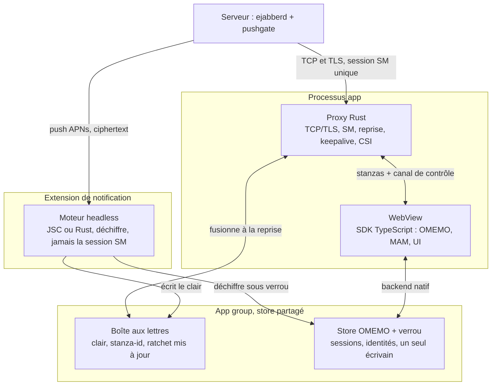

# Fluux natif : proxy local XMPP et moteur d'extension iOS

**Date:** 2026-10-08
**Status:** Design note, en discussion, rien de planifié
**Scope:** Promotion du proxy Rust `xmpp_proxy` en MITM local actif, moteur sans
interface pour l'extension de notification iOS (déchiffrement, rattrapage), store
partagé dans l'app group, et ce que le serveur (ejabberd, pushgate) doit fournir.

Related docs: [IOS_DEVELOPMENT.md](IOS_DEVELOPMENT.md), [CONNECTION.md](CONNECTION.md),
[ENCRYPTION.md](ENCRYPTION.md), [MAM_CATCHUP.md](MAM_CATCHUP.md),
[2026-07-17-mam-catchup-roadmap.md](2026-07-17-mam-catchup-roadmap.md).

## Contexte

La question de départ : sur iOS, une app qui gère la connexion XMPP nativement pourrait intercepter maintenance, push et récupération de messages sans réveiller l'interface JavaScript. Le design envisagé est un proxy client dans le processus de l'app, TCP et TLS vers le serveur, WebSocket loopback vers la WebView, capable d'insérer des stanzas de lui-même dans les deux sens. Techniquement, un man in the middle local.

Ce proxy existe déjà, en Rust, dans `apps/fluux/src-tauri/src/xmpp_proxy/` (environ 4 500 lignes). Il est actif sur desktop, iOS et Android via le flag `nativeXmppProxy` de `capabilities.ts`. Aujourd'hui c'est un traducteur de framing passif.

| Brique | État actuel | Où |
| --- | --- | --- |
| Transport natif | Résolution SRV, happy eyeballs, STARTTLS ou TLS direct, reframing WebSocket vers TCP | `xmpp_proxy/mod.rs`, `dns.rs`, `framing.rs` |
| Interprétation des stanzas | Découpage seulement ; lit l'erreur de stream et le `to` du `<open/>` | `framing.rs` |
| SASL2, FAST, bind2, stream management | Dans le SDK TypeScript, dans la WebView | `Connection.ts`, `smPatches.ts` |
| Extension de notification | Décore la notification avec les noms et le badge partagés par l'app group ; ne se connecte à rien, ne déchiffre rien | `mobile/ios/NotificationService.swift` |
| Push | pushgate envoie `from` et le corps ; ne signale pas les mentions en salon | pushgate, `plugins/push` |
| Stockage E2EE des plugins | Interface interchangeable de quatre opérations sur des octets ; IndexedDB sur web ; clé OpenPGP en Rust dans app_data plus keychain | `PluginStorage.ts`, `openpgp_storage.rs` |
| Stockage dans l'app group | Noms des contacts et salons, compteur de badge | `NotificationNames.json`, `NotificationBadge.json` |

OMEMO n'est pas dans ce dépôt : c'est la librairie cleanroom séparée, en TypeScript. Rien du stockage E2EE n'est dans l'app group aujourd'hui.

## Ce que le natif achète réellement sur iOS

Sur iOS, gérer la connexion nativement n'achète pas de connexion en arrière-plan. L'OS tue la socket dès que le processus est suspendu, quel que soit le langage. Le natif achète une seule chose : pouvoir tourner sans la WebView.

La question de conception n'est donc pas « qui tient la socket » mais « quel moteur sans interface tourne hors WebView, et comment le serveur lui rend la tâche triviale ».

| Situation | Le natif aide | Pourquoi |
| --- | --- | --- |
| App suspendue, message reçu | Non | Aucun processus ne tourne ; seul le push arrive |
| Push reçu, app suspendue | Oui, via l'extension | L'extension est un processus à part, sans WebView, 30 s et 24 Mo |
| Passage en arrière-plan | Oui, dans la fenêtre de grâce | WebKit gèle les timers JS très vite ; tokio tourne jusqu'à la suspension |
| Crash du processus WebContent | Oui | WKWebView tourne dans un processus séparé, le premier jeté sous pression mémoire ; le proxy dans le processus de l'app survit |
| Démarrage à froid | Oui, partiellement | Le proxy peut négocier TLS et reprendre la session avant que la WebView ne soit prête |
| Partage depuis la share sheet | Oui | Autre extension, même contrainte : pas de WebView |
| Appels | Obligatoire | CallKit exige PushKit ; chemin natif imposé, orthogonal à la messagerie |

Sur Android, le même proxy dans un service foreground garde la connexion pendant que l'activité est détruite. La brique Rust sert les trois plateformes ; iOS en tire un sous-ensemble.

## Le proxy local comme MITM actif

Promouvoir le pont passif en MITM actif a du sens, à condition de nommer ce que ça change : dès que deux parties émettent sur un même stream, la propriété du stream devient le vrai sujet, pas l'injection elle-même.

**Vers le serveur.** Les `<r/>` et `<a/>` du stream management, le CSI actif ou inactif calé sur le cycle de vie de l'app, la reprise SM au relancement, les keepalives. Sur iOS, le gain concret est dans la fenêtre de grâce : envoyer `<inactive/>` et vider les acks là où le JS n'a plus la main. La PR #1656 fait ce travail côté JS aujourd'hui.

**Vers le client.** Rejouer les stanzas reçues pendant que le JS n'écoutait pas, et signaler au JS ce qui s'est passé sans lui. Le cas qui compte sur iOS est le crash du processus WebContent : le proxy garde le stream, le JS se rattache.

**Ce que ça n'achète pas sur iOS** : la réception en arrière-plan, et l'extension de notification. L'extension est un autre processus, elle ne voit jamais ce proxy.

Quatre problèmes fixent l'ordre des travaux :

1. **Le compteur SM.** Si le proxy envoie `<a/>`, son compte doit refléter ce que le JS a persisté, pas ce que le proxy a reçu. Sinon un kill entre l'ack du proxy et la persistance côté JS perd le message à la reprise. Le proxy compte, mais n'acquitte que ce que le JS lui a confirmé.
2. **Un canal de contrôle déclaré.** Cette confirmation, le « session reprise, compteurs à n », le « WebContent redémarré, rattache-toi » ne doivent pas passer en fausses stanzas XMPP. Le loopback cesse d'être du pur RFC 7395 et devient un protocole privé avec un canal à côté. L'événement Tauri `xmpp-keepalive` de `main.rs` est ce canal qui s'élargit.
3. **Un vrai parseur et un suivi passif de l'état.** Injecter un IQ demande un espace d'ids sans collision avec le JS et un filtre pour router la réponse. Injecter au bon moment demande de savoir où en est le stream : features, SASL2 terminé, bind2 fait, SM activé. Le proxy a un découpeur de stanzas, pas un parseur d'attributs : passer à quick-xml ou minidom, et d'abord observer la machine à états sans la piloter.
4. **L'authentification, point d'inflexion.** Pour reprendre la session avant que la WebView ne démarre, le proxy doit tenir le token FAST et l'id SM, faire SASL2, bind2 et la reprise lui-même, puis le SDK doit savoir se rattacher à un stream déjà lié. C'est un mode nouveau dans `Connection.ts`, qui distingue `online` et `resumed` en ayant négocié lui-même. Au-delà, le proxy est un cœur XMPP et le JS son client d'interface.

Deux points de sécurité du MITM. Le loopback doit rester inaccessible aux autres processus locaux : port aléatoire, contrôle d'Origin, secret par lancement dans la poignée de main, à vérifier dans ce que fait `accept_hdr_async`. Sur Android en service séparé, le pont devient une surface IPC inter-processus. Et le proxy ne doit jamais avoir besoin de déchiffrer : il voit le ciphertext OMEMO, c'est la frontière qui le garde simple.

## Le moteur de l'extension qui déchiffre

L'extension de notification doit obtenir le contenu du message, le déchiffrer, afficher la notification et le laisser là où l'interface le retrouvera. Elle n'a ni WebView, ni accès au proxy de l'app. Deux stratégies, dont une seule partage du code avec le proxy.

| | Stratégie payload | Stratégie fetch |
| --- | --- | --- |
| Le push transporte | Expéditeur, id de stanza, ciphertext OMEMO lui-même | Un id seulement |
| L'extension se connecte | Jamais | Oui, ressource distincte, requête MAM ciblée par id, ou endpoint HTTP sans état |
| Code de transport dans l'extension | Aucun | Le cœur Rust du proxy : parseur, machine à états, SASL2, FAST, bind2 |
| Ce qu'il faut en plus | Crypto et store partagé | Crypto, store partagé, credentials en keychain avec access group |
| Dépend du serveur | Oui : le push doit être enrichi | Non, fonctionne avec tout serveur qui pousse |
| Risque mémoire | Faible : pas de parseur, pas de stream | Plus élevé |

Recommandation : payload d'abord. Nous contrôlons pushgate et ejabberd, le ciphertext E2EE traverse APNs sans rien révéler, et ça découple complètement les deux chantiers. Fetch reste la solution de repli pour les serveurs qui n'enrichissent pas le push, et c'est le seul cas qui justifie un cœur Rust partagé.

La crypto est en TypeScript, hors de ce dépôt. Deux voies pour la faire tourner dans l'extension :

- **JavaScriptCore** avec un bundle réduit à la librairie OMEMO et au backend de store. Réutilise le code validé en interop. Risque : la mémoire, à mesurer contre la limite de l'extension. La stratégie payload rend cette voie crédible, parce que le bundle n'embarque ni transport ni parseur XML.
- **Port Rust** : un second cleanroom, avec sa propre validation d'interop. Cohérent avec Tauri, mais c'est un chantier pluriannuel.

La voie Swift, celle de Monal et Siskin, duplique tout le SDK. Écartée.

## Le fetch dans le budget de l'extension

Un client Rust conçu pour ce seul scénario tient le rattrapage en 5 à 8 allers-retours réseau. Les 30 secondes de l'extension ne sont menacées que par la perte de paquets, pas par la latence. Le fetch doit donc être une course contre une échéance interne, avec le contenu du push comme repli prêt dès le départ.

| Étape | RTT | Condition pour tenir ce chiffre |
| --- | --- | --- |
| Résolution SRV | 0 | Endpoint lu dans le cache de l'app group |
| TCP | 1 | Happy eyeballs, déjà dans le proxy |
| TLS | 1 ou 3 | 1 si le cache dit que TLS direct sur 5223 a marché la dernière fois ; 3 via STARTTLS sinon |
| Ouverture de stream, features | 1 | Incompressible sans pipelining optimiste |
| SASL2 + FAST + bind2, SM non activé | 1 | Token FAST en keychain access group ; SCRAM classique coûte 2 RTT plus un nouveau stream |
| Requête MAM depuis le dernier id couvert | 1 | `after-id` plus `max` ; une requête pour tout l'archive utilisateur, une par salon concerné |
| Bundle OMEMO d'un nouvel expéditeur | 0 ou 1 | Seulement sur un message de pré-clé |
| Fermeture propre | 0 | On n'attend pas la réponse |

À 300 ms de latence, environ 2 secondes. À 1 seconde de latence, 6 à 8 secondes. Il faut ajouter le lancement du processus, le réveil de la radio cellulaire et la vérification du certificat, de l'ordre d'une seconde. Ce qui casse le budget, c'est la retransmission TCP après perte, 1 puis 3 puis 7 secondes, un portail captif, ou une bascule Wi-Fi vers cellulaire.

**Ce que « bien optimisé » veut dire.**

- Une connexion sans SM, sans présence, sur une ressource distincte, à durée de vie courte. Sans présence, pas de flot de roster et aucun message routé vers cette ressource. Sans SM, pas de session en attente côté serveur après fermeture, sinon mod_push pousserait pour la ressource de l'extension elle-même.
- Jamais la reprise de la session de l'app. La ressource distincte coûte un RTT de plus, c'est le bon prix.
- Une seule requête MAM pour tout l'archive utilisateur depuis le dernier id couvert, que le SDK persiste déjà dans son enregistrement de couverture durable. En un aller-retour, toutes les conversations directes sont rattrapées, pas seulement celle du push.
- Une échéance interne autour de 20 secondes. À l'échéance, l'extension livre la notification de repli et persiste ce qu'elle a déjà reçu, même partiel.
- Un seul fetch par rafale de pushs : le verrou de la boîte aux lettres fait qu'un seul appel se connecte, les autres attendent son résultat.

**Le cache de connexion.** TLS direct n'est pas toujours activé côté serveur, et le proxy actuel ne persiste rien : il résout `_xmpps-client` puis `_xmpp-client` à chaque connexion. Tenter 5223 sans savoir, sur un serveur qui ne l'écoute pas, bloque jusqu'au timeout TCP. Le proxy le fixe à 15 secondes par endpoint et 30 au total, deux constantes qui mangent tout le budget de l'extension. Le savoir négatif, « pas de TLS direct ici », vaut autant que le savoir positif.

| Entrée du cache | Contenu | Écrit par | Où |
| --- | --- | --- | --- |
| Endpoint qui a marché | Hôte, port, mode TLS direct ou STARTTLS, domaine XMPP pour le SNI, horodatage, TTL du SRV | Proxy de l'app, après chaque connexion réussie | Fichier app group, par domaine |
| Capacités observées du serveur | SASL2, FAST, bind2, mécanismes, support de `after-id` en MAM | Proxy de l'app | Fichier app group |
| Ticket de session TLS 1.3 | Reprise sans vérification complète de la chaîne ; le cache de rustls est en mémoire, son trait de stockage doit être implémenté pour persister | Proxy de l'app | Fichier app group |
| Token FAST | Authentification en 1 RTT | SDK aujourd'hui, proxy à l'étape 9 | Keychain, access group |
| Dernier id d'archive couvert | Borne basse de la requête MAM | SDK | Fichier app group |

Politique côté extension : le cache est advisory, le proxy de l'app fait la découverte complète et le corrige.

1. Cache présent : connecter le mode connu, timeout de connexion court, autour de 5 secondes.
2. Échec : basculer sur l'autre mode une seule fois, puis abandonner le fetch. Pas de nouvelle résolution SRV dans le budget.
3. Cache absent, premier lancement : pas de fetch, payload seulement. La première connexion de l'app remplit le cache.
4. Cache plus vieux que le TTL du SRV : utilisé quand même en premier, marqué à rafraîchir pour le proxy.

Conséquence sur les stratégies : le fetch bien fait n'est pas un repli médiocre, c'est un complément. Le payload garantit la notification à zéro RTT ; le fetch, dans le budget restant, préremplit la boîte aux lettres pour toutes les conversations, et l'app s'ouvre déjà à jour. Il reste seul sur les serveurs qui n'enrichissent pas le push.

## La reprise partagée de la session

Reprendre la session SM de l'app depuis l'extension devient jouable avec la démarche proxy, et c'est elle qui le rend jouable : dès que le proxy Rust possède le stream management, l'état de session, id SM et compteurs, vit dans l'app group et le détenteur du moment le reprend. L'extension et le proxy sont le même code, la reprise n'est qu'un changement de détenteur. Recommandation : préparer le modèle, ne pas livrer avec.

| | Ressource distincte | Reprise partagée |
| --- | --- | --- |
| RTT de rattrapage | MAM `after-id`, 1 RTT | Reprise inline dans SASL2, le serveur rejoue la file non acquittée, 0 RTT |
| Sessions côté serveur | Deux, la seconde sans SM ni présence, courte | Une |
| Pushs pendant le run | La session de l'app reste en attente : chaque message produit son push, son run, sa notification | La session est active : les messages arrivent sur le stream, pas en push ; un run ne livre qu'une notification |
| Course au premier plan | Aucune | Deux processus veulent la même session ; le serveur donne raison au dernier et casse l'autre |
| Détachement | Fermeture propre | TCP fermé sans `</stream>` : le FIN passe la session en attente, comme quand iOS tue l'app |
| Discipline d'ack | Locale à l'extension | Traverse les processus : persister le compteur avant chaque `<a/>` |
| Reprise refusée | Sans objet | Lier à neuf la ressource de l'app, persister le nouvel état, l'app reprendra celui-là |

La machinerie que la reprise partagée impose, et qui est le problème que Monal a mis des années à stabiliser :

- Un verrou `fcntl` dans l'app group, libéré par le noyau à la mort du processus. Jamais un fichier drapeau, qui survit à un kill de l'extension à 30 secondes.
- Une notification Darwin inter-processus pour que l'extension cède la session en quelques centaines de millisecondes quand l'app arrive au premier plan.
- Le dédoublonnage par stanza-id de la boîte aux lettres devient un chemin normal, plus une exception : un kill de l'extension laisse l'app reprendre avec un compteur en retard et rejouer ce qui est déjà écrit.
- L'échec de reprise testé autant que le succès.

Un RTT et une session de moins ne valent pas le risque d'un conflit de session, la pire classe de panne pour un messager. L'état de session va dans l'app group dès l'étape 7, parce que l'étape 9 en a besoin de toute façon ; l'extension est livrée avec la ressource distincte ; la reprise partagée reste une optimisation derrière un flag, à activer quand le verrou et le signal de cession auront tourné en production sur desktop, où le crash WebContent exerce déjà la même machinerie.

## Les trois couplages entre proxy et extension

Le proxy et l'extension ne se parlent jamais directement. Ils se disputent trois choses, et le proxy est le point naturel de réconciliation parce qu'il voit chaque stanza avant le JS.

**Le ratchet est le couplage dur.** Le Double Ratchet consomme la clé de message au déchiffrement. Si l'extension déchiffre un message, l'app ne peut plus le déchiffrer à partir de l'état avancé. Et c'est le cas normal : le message était dans la file SM en attente d'ack à la suspension, le serveur l'a poussé, puis il le rejoue à la reprise. Trois règles en découlent.

- Un seul store OMEMO, dans l'app group, derrière un backend natif qui implémente l'interface `StorageBackend` existante. Deux copies divergent dès le premier message.
- Un seul écrivain à la fois : un verrou de fichier dans l'app group, et l'extension renonce à déchiffrer si l'app est active. Même en premier plan, l'extension tourne pour les pushs à contenu mutable, donc la course existe.
- Dédoublonner **avant** de déchiffrer. L'app doit savoir que ce stanza-id est déjà déchiffré avant d'entrer dans le ratchet. Aujourd'hui le dédoublonnage du SDK intervient sur le message décodé.

C'est ici que le MITM paie : le proxy lit la boîte aux lettres de l'extension et, quand la stanza rejouée arrive, il la remplace ou l'annote avec le clair déjà obtenu avant de la passer au JS. Le JS ne voit jamais le ciphertext mort. Sans le proxy, cette logique vit dans `Connection.ts` et court avant le pipeline E2EE.

**La session est le couplage à interdire.** L'extension ne doit jamais reprendre la session SM du proxy, elle la volerait. Un lien plus subtil : mod_push ne pousse que pour une session en attente ou détachée. Si le proxy acquitte sur persistance côté JS, un JS lent en premier plan fait apparaître un push, donc une course extension contre app. Le verrou la couvre, mais c'est le proxy qui en règle la fréquence.

**Le store est le couplage de confort.** L'extension doit laisser le message là où l'interface le retrouvera, sinon on déchiffre pour la notification et on recommence pour l'écran. À court terme, une boîte aux lettres dans l'app group : clair, stanza-id, horodatage, état du ratchet mis à jour. L'app l'ingère au lancement, le proxy à la reprise. À long terme, un seul SQLite dans l'app group lu par les deux, ce qui est aussi la réponse à #1637.

Le serveur n'a qu'une session SM, celle du proxy ; l'extension ne reçoit que des pushs. Les deux processus ne se rejoignent que dans l'app group, et c'est le proxy qui réinjecte le travail de l'extension dans le flux vu par le JS.

## Apple Watch

Trois architectures possibles, et chacune s'articule différemment avec ce design. L'ordre recommandé : notifications miroir maintenant, app Watch dépendante quand une app Watch sera voulue, app autonome seulement avec la crypto en Rust.

| | Notifications miroir | App Watch dépendante | App Watch autonome |
| --- | --- | --- | --- |
| Ce que la montre affiche | La notification produite par l'extension, déchiffrée dès l'étape 4 | Une projection du store partagé, envoyée par l'app iPhone | Ce qu'elle reçoit et déchiffre elle-même |
| Transport | Aucun côté montre | WatchConnectivity ; l'app iPhone est le seul transport, réveillée en arrière-plan quand l'app Watch est au premier plan | Sa propre session XMPP, sa propre identité OMEMO |
| Lien avec l'extension | Direct : la notification miroir porte son travail | Aucun : WatchConnectivity n'existe pas dans les extensions ; le travail de l'extension atteint la montre par le miroir tout de suite, par l'app ensuite | Aucun : pas d'app group entre deux appareils |
| Réponse depuis la montre | L'action relance l'app iPhone en arrière-plan ; le proxy envoie | Message WatchConnectivity vers l'app iPhone, qui envoie | Directement, avec un ratchet de plus à gérer |
| Coût | Nul | Projection du store, réveil de l'app | Un troisième appareil avec tous les problèmes de l'extension, multipliés |

Trois conséquences pour le reste du document.

- La réponse depuis la notification passe par l'app, jamais par l'extension : une action de notification, montre ou téléphone, relance l'app iPhone en arrière-plan, et c'est le proxy qui envoie. Ça règle en partie la question du second écrivain du ratchet.
- La projection vers la montre se construit sur le store partagé : un argument de plus pour le SQLite unique dans l'app group dès l'étape 2.
- watchOS n'a pas JavaScriptCore. Si une Watch autonome est sur la feuille de route, la crypto doit être en Rust, ce qui tranche la première question ouverte.

## La partie serveur

Le « proxy plus intelligent » côté serveur existe déjà : c'est ejabberd plus pushgate. Un composant hébergé séparé qui tiendrait la session à la place de l'utilisateur est écarté : problème de confiance, rupture de l'histoire « n'importe quel serveur XMPP », concentration des métadonnées E2EE. La leçon du proxy sliding-sync de Matrix vaut ici : il a fini absorbé dans le serveur.

Ce qui rend la stratégie payload possible, et qui contourne le conflit à deux processus parce que l'extension n'ouvre jamais de stream :

| Capacité serveur | Ce qu'elle apporte | Où | Sans elle |
| --- | --- | --- | --- |
| Flag de mention calculé par mod_push | Notifications de salon correctes | ejabberd | L'extension ne sait pas si un message de salon mérite une alerte |
| Ciphertext OMEMO ou OX dans le push | L'extension déchiffre sans se connecter | pushgate | Stratégie fetch, cœur XMPP dans l'extension |
| Payload de push chiffré avec une clé par device | Le corps en clair ne transite plus lisible par APNs | pushgate, qui stocke déjà le JID | Corps en clair exposé à Apple pour les messages non E2EE |
| Endpoint de rattrapage « tout depuis ce jeton » en une requête HTTP | Pré-chauffage et repli fetch sans négociation de stream | ejabberd | Reprise SM ou MAM complète, trop lourde pour 30 s et 24 Mo |
| Reprise à 1 RTT : SASL2, FAST, bind2, timeout SM long | Reconnexion bon marché au premier plan, sans changement d'architecture | ejabberd, déjà supporté | Handshake complet à chaque retour |

Tigase fait du push chiffré avec une clé enregistrée par le client ; c'est le précédent à regarder pour la troisième ligne. Chaque capacité se dégrade proprement sur Prosody ou Openfire : l'extension retombe sur ce que le push transporte, puis sur fetch.

## Recommandation et séquence

Oui au MITM local, oui au moteur d'extension, mais comme deux chantiers découplés par l'app group, et dans un ordre où chaque étape est utile seule. Le proxy progresse de passif à propriétaire du stream ; l'extension progresse de décoration à déchiffrement ; le store partagé est le prérequis des deux.

| # | Étape | Chantier | Utile seule parce que | Dépend de |
| --- | --- | --- | --- | --- |
| 1 | Reprise à 1 RTT dans le JS : SASL2, FAST, bind2, timeout SM long | Protocole | Reconnexion bon marché au premier plan | Rien |
| 2 | Store E2EE dans l'app group, backend natif derrière `StorageBackend`, verrou de fichier, keychain en access group | Store | Répond à #1637, évite l'éviction WKWebView | Rien |
| 3 | Push enrichi : mention, ciphertext, payload chiffré par device | Serveur | Notifications de salon correctes dès la première ligne | Rien |
| 4 | Extension qui déchiffre en JavaScriptCore et écrit la boîte aux lettres ; mesure mémoire | Extension | Notifications E2EE lisibles sans ouvrir l'app | 2, 3 |
| 5 | Dédoublonnage avant déchiffrement dans le SDK, ingestion de la boîte aux lettres au lancement | SDK | Pas de double déchiffrement à la reprise | 4 |
| 6 | Proxy : parseur, suivi passif de l'état du stream, canal de contrôle déclaré | Proxy | Fondation sans changement de comportement | Rien |
| 7 | Proxy : propriété du SM avec ack sur persistance JS, CSI et acks dans la fenêtre de grâce | Proxy | Remplace le travail JS de #1656, survit au crash WebContent | 6 |
| 8 | Proxy : fusion de la boîte aux lettres dans le flux à la reprise | Proxy | Le JS ne voit jamais le ciphertext mort | 5, 7 |
| 9 | Proxy : authentification et reprise avant la WebView, mode « rattachement » dans `Connection.ts` | Proxy | Démarrage à froid plus court, si les mesures le justifient | 7 |
| 10 | Cœur Rust partagé pour la stratégie fetch | Extension | Préremplit toutes les conversations dans le budget de l'extension ; seul chemin sur un serveur sans push enrichi | 6, 9 |

Les étapes 1 à 3 n'ont aucune dépendance entre elles et peuvent avancer en parallèle. L'étape 4 est celle qui demande une mesure avant décision : si le bundle JavaScriptCore ne tient pas dans la mémoire de l'extension, la voie Rust pour la crypto remonte dans la liste.

## Questions ouvertes

- [ ] Le bundle JavaScriptCore réduit à OMEMO plus le backend de store tient-il sous la limite mémoire de l'extension ? C'est la mesure qui décide entre JavaScriptCore et un port Rust de la crypto.
- [ ] Quelle sémantique d'ack SM pour le proxy : « reçu par le proxy » ou « persisté par le JS » ? La seconde est plus sûre mais fait apparaître des pushs quand le JS est lent au premier plan.
- [ ] Le canal de contrôle proxy-JS : événements Tauri élargis, ou second chemin sur le WebSocket loopback ? Sur Android en service séparé, lequel survit à la frontière de processus ?
- [ ] Format du store partagé : SQLite unique dans l'app group lu par les deux processus dès l'étape 2, ou boîte aux lettres d'abord et SQLite ensuite ?
- [ ] Le push chiffré par device vaut-il le coût côté pushgate, sachant que les messages E2EE n'en ont pas besoin et que seuls les messages en clair y gagnent ?
- [ ] Faut-il que l'extension renonce à déchiffrer quand l'app est active, ou qu'elle déchiffre et que l'app ingère son résultat même au premier plan ?
- [ ] Répondre depuis la notification : une action qui fait écrire l'extension dans le ratchet, donc un second écrivain. À traiter dès la conception du verrou ou à exclure dans un premier temps ?
- [ ] Le mode « rattachement » du SDK à un stream déjà lié : quel contrat minimal entre le proxy et `Connection.ts`, et comment le tester sans Tauri ?
- [ ] L'extension peut-elle poster des notifications locales supplémentaires ? Si non, les messages reçus sur le stream pendant une reprise partagée perdent leur notification, et la reprise partagée est exclue pour les rafales.
- [ ] Une app Watch autonome est-elle sur la feuille de route ? Si oui, la voie Rust pour la crypto est imposée dès le départ.
