# Fluux Messenger — UX Review

A snapshot review of the user interface and main flows on the `main` branch as
of 2026-04-25, captured in demo mode (`/demo.html?tutorial=false`) at desktop
1280×800 and mobile 375×812. Findings are grouped by area and prioritised by
**Severity × (1 / Effort)** so the highest-leverage fixes are at the top.

- **Severity** — `H` blocks a primary task or risks data loss · `M` adds daily
  friction · `L` polish.
- **Effort** — `S` < 1 day · `M` 1–3 days · `L` multi-day or design-led.

Screenshots referenced are under `docs/ux-review-screenshots/`.

---

## Executive summary — top 5 fixes

1. **Surface connection state at the top of every screen** — today the only
   indicator is a small chip inside the sidebar's user menu. (H · S)
2. **Show a real "sending / sent / failed" state on outgoing messages** — the
   data exists in `MessageBubble`, but the optimistic and confirmed states
   look identical. (H · M)
3. **Promote subscription requests / room invitations out of the Events tab** —
   today they sit alongside reaction logs; users with a pending request need to
   know within seconds, not after a tab visit. (H · S)
4. **Add labels (or auto-expanding labels) to the icon rail** — seven unlabeled
   icons including two distinct-but-similar settings glyphs at the bottom is
   the single biggest first-run friction. (M · S)
5. **Discoverable command palette and "Add contact / Join room" entry points** —
   both flows are buried behind icon-only dropdowns or `⌘K`; new users won't
   find them. (M · S)

---

## 1. Login & first-run

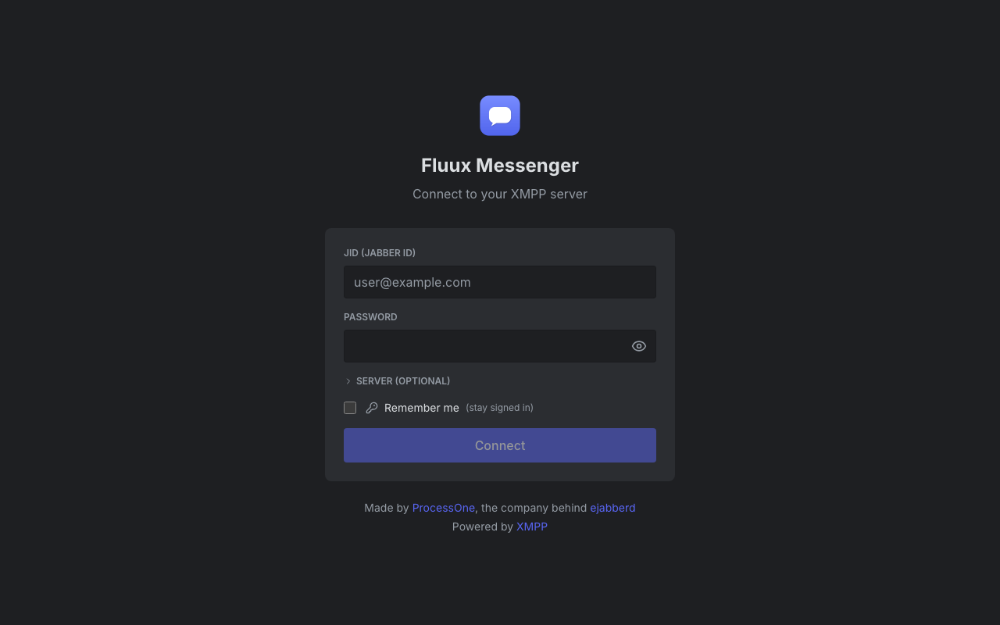
*[18-login-screen.png](ux-review-screenshots/18-login-screen.png) ·
`apps/fluux/src/components/LoginScreen.tsx`*

The form is clean, but for a first-time user it makes a few assumptions that
won't hold:

| #   | Issue                                                                                                                                                                                                                                                                         | Recommendation                                                                                                                                                                                                                                                                                                                  | Sev | Eff |
|-----|-------------------------------------------------------------------------------------------------------------------------------------------------------------------------------------------------------------------------------------------------------------------------------|---------------------------------------------------------------------------------------------------------------------------------------------------------------------------------------------------------------------------------------------------------------------------------------------------------------------------------|-----|-----|
| 1.1 | "Connect to your XMPP server" assumes the user already knows what XMPP is and that they have an account. There is no path to **register** a new account, no path to "find a server", and no link to "what is XMPP?".                                                          | Add a secondary action under the Connect button: "Don't have an account? **Find a server / Sign up**" linking to a curated list (e.g. xmpp.org/getting-started or a built-in onboarding flow). For non-XMPP-savvy users, add a one-line explainer above the form: "Fluux works with any XMPP server — like email but for chat." | H   | M   |
| 1.2 | "Server (optional)" is collapsed behind a `>` disclosure, so users on corporate/self-hosted servers must guess the field exists. The `Cmd+,` shortcut to expand it is invisible to the user.                                                                                  | Auto-expand the server field when the JID's domain has no DNS-WSocket SRV record discovered, or when the previous attempt failed with a network error.                                                                                                                                                                          | M   | M   |
| 1.3 | "Remember me (stay signed in)" pairs a checkbox with a key icon — pleasant, but the implication ("we will store credentials in your OS keychain") is hidden. On the web build, the same checkbox stores creds in `localStorage` which has very different security properties. | Add a one-line caveat under the checkbox that varies by build: "Stored in macOS Keychain" vs. "Stored in this browser".                                                                                                                                                                                                         | M   | S   |
| 1.4 | No password visibility toggle "shows" the password but there is no analogous "validate JID format as you type" — a typo'd JID currently fails server-side after a network round-trip.                                                                                         | Validate JID shape locally (`local@domain`) before enabling the Connect button; show inline help on bad shapes.                                                                                                                                                                                                                 | L   | S   |
| 1.5 | The footer credits ProcessOne and ejabberd. Beautiful for an XMPP audience; less so for a non-technical first user who may not know what those mean.                                                                                                                          | Keep the footer, but consider reordering so the link to "What is XMPP?" comes first and the credits feel like a signature, not a gate.                                                                                                                                                                                          | L   | S   |

**Missing:** error UX for TLS/cert failures, account registration flow,
"sign in with another device" QR scanning. Not blockers, but each is a
recurring XMPP-onboarding question.

---

## 2. Sending & receiving messages

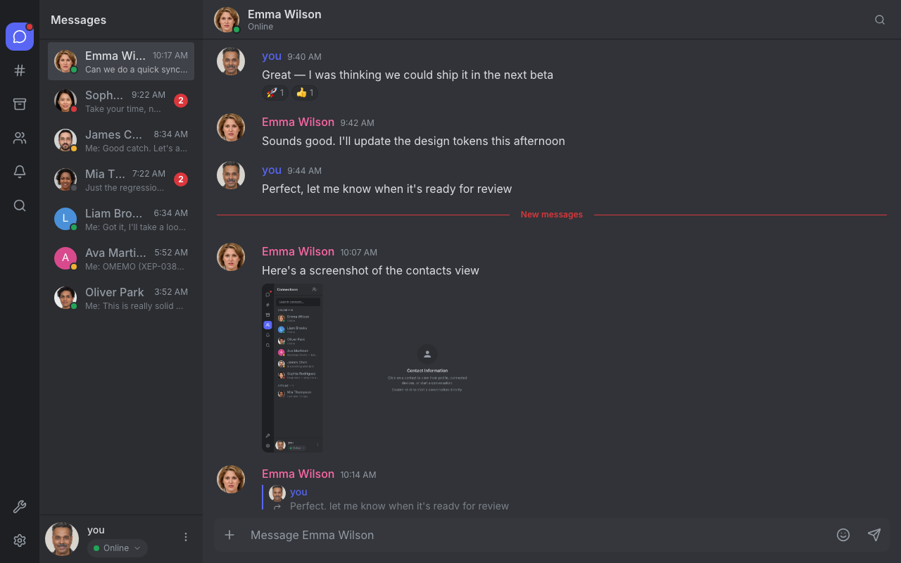
*[02-messages-1to1.png](ux-review-screenshots/02-messages-1to1.png) ·
`apps/fluux/src/components/conversation/MessageBubble.tsx`,
`apps/fluux/src/components/MessageComposer.tsx`*

| #   | Issue                                                                                                                                                                                                                                                                          | Recommendation                                                                                                                                                                                                                                | Sev | Eff |
|-----|--------------------------------------------------------------------------------------------------------------------------------------------------------------------------------------------------------------------------------------------------------------------------------|-----------------------------------------------------------------------------------------------------------------------------------------------------------------------------------------------------------------------------------------------|-----|-----|
| 2.1 | **Outgoing messages have no "sending / sent / delivered" state.** A message I just typed and one the server has acknowledged render identically. If the server rejects or the network drops mid-send, the user has no immediate signal — only a delayed error appears.         | Render three visually distinct states: pending (50 % opacity + clock glyph), sent (no decoration), failed (red border + retry CTA). The retry CTA already exists in code; promote it from "appears on hover" to "always visible when failed". | H   | M   |
| 2.2 | **No read receipts for 1:1 chats** (XEP-0184 not surfaced). For a reference XMPP client this is table stakes; users coming from Signal/iMessage will perceive the absence as broken.                                                                                           | Add an opt-in setting + render double-checkmark on the *last* delivered/read message per thread. Don't render per-message — that's noisy.                                                                                                     | M   | M   |
| 2.3 | **"New messages" divider is correctly positioned** (visible in the screenshot at line "10:07 AM"), but it disappears as soon as the user scrolls past, with no scroll-to-unread affordance. On a long thread this means missing context.                                       | Add a floating "↓ N new" pill anchored to the bottom-right of the message list when the user is scrolled above the divider. Tap to jump back.                                                                                                 | M   | S   |
| 2.4 | **No per-conversation draft.** Typing in conversation A, switching to B, switching back, the input is empty. Pending attachments are also dropped on switch.                                                                                                                   | Persist composer text and pending attachments per JID in `chatStore`, restore on `setActiveConversation`.                                                                                                                                     | H   | M   |
| 2.5 | Reactions render as small pill chips below the message ("🚀 1, 👍 1") — visually clean, but **clicking them opens nothing** (no "who reacted" tooltip discoverable from the screenshot). For a moderation-relevant feature this is a discoverability gap.                      | Hover/click → tooltip listing reactors.                                                                                                                                                                                                       | L   | S   |
| 2.6 | The reply quote ("Perfect, let me know when it's ready for review" on Emma's last message) is rendered with a soft purple left-border but **the original message it points to is not visually linked** — clicking the quote should scroll to and briefly highlight the source. | Wire `onClick` on quoted message → scroll to source + apply the existing `message-highlight` 1.5 s pulse animation.                                                                                                                           | M   | S   |
| 2.7 | The composer placeholder reads "Message Emma Wilson". Good. But the `+` icon, emoji icon, and send icon are equally weighted — visually the send button doesn't draw the eye on a dark background.                                                                             | Make the send button accent-coloured when the input is non-empty; muted when empty. Currently it's always muted.                                                                                                                              | L   | S   |

---

## 3. Conversation list & sidebar

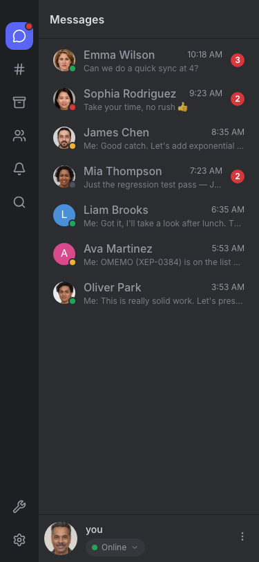
*[14-mobile-messages-list.png](ux-review-screenshots/14-mobile-messages-list.png) ·
`apps/fluux/src/components/sidebar-components/ConversationList.tsx`*

| #   | Issue                                                                                                                                                                                                                                                                                                                                   | Recommendation                                                                                                                                                                                                                                  | Sev | Eff |
|-----|-----------------------------------------------------------------------------------------------------------------------------------------------------------------------------------------------------------------------------------------------------------------------------------------------------------------------------------------|-------------------------------------------------------------------------------------------------------------------------------------------------------------------------------------------------------------------------------------------------|-----|-----|
| 3.1 | **Names are aggressively truncated** ("Emma Wi…", "Sophia …", "Mia T…") on a 220 px-wide sidebar even when the name fits in 12 characters. The unread badge takes precedence over the name.                                                                                                                                             | Move the unread badge to overlay the avatar (top-right) instead of competing with the name column. Frees ~24 px for the name.                                                                                                                   | M   | S   |
| 3.2 | **The icon rail at the left edge is a row of seven unlabeled icons.** A new user has to hover each to learn what they are. The icons themselves are not all conventional: a `#` for rooms, a bell for events, a `⚒` for admin. The `⚒` and `⚙` icons sit adjacent at the bottom (Admin and Settings) and look very similar at a glance. | Either (a) auto-expand to a labeled rail on first run (collapse after 7 days), (b) always show labels under icons (Discord/Slack pattern), or (c) widen the rail by 60 px and add labels. The single highest-leverage first-run fix in the app. | M   | S   |
| 3.3 | **The "Messages" tab has a red dot indicator** when there are unread items, but the **other tabs (Events, Rooms) do not** even though they also have unread/pending items.                                                                                                                                                              | Apply the dot indicator consistently to any tab whose content has new items since `lastSeen`.                                                                                                                                                   | M   | S   |
| 3.4 | **"Moi:" prefix on outgoing messages** ("Moi: Good catch…", "Moi: OMEMO…") is doubly redundant: the conversation row is already showing the *contact's* avatar and name on the left, so a "Moi:" prefix is the only thing telling you *you* sent it. But the prefix steals 24 px of the preview text.                                   | Replace the "Moi:" prefix with a small ↪ glyph or a thin left border on the preview line.                                                                                                                                                       | L   | S   |
| 3.5 | The sidebar has **no tab-level empty states** — when no conversation is selected the right pane shows a generic "Conversations privées / Sélectionnez une conversation" message, with no CTA.                                                                                                                                           | Replace the description with two action buttons: "Start a conversation" (opens the contact picker) and "Join a room".                                                                                                                           | M   | S   |

---

## 4. Reconnection & network state

*Source: `apps/fluux/src/components/sidebar-components/PresenceSelector.tsx`*

This is the single most invisible piece of state in the app. The connection
status only appears as a colour change inside the user menu chip at the
bottom-left of the sidebar. None of the captured screenshots make it visible
because the demo client is in a synthetic "online" state.

| #   | Issue                                                                                                                                                                                             | Recommendation                                                                                                                                                                                            | Sev | Eff |
|-----|---------------------------------------------------------------------------------------------------------------------------------------------------------------------------------------------------|-----------------------------------------------------------------------------------------------------------------------------------------------------------------------------------------------------------|-----|-----|
| 4.1 | **No top-level banner during reconnect.** A user mid-conversation can be offline and still typing into a composer that won't deliver — the only signal is a tiny status chip far from the cursor. | ~~Add a sticky banner above the chat header~~ **Implemented in #483, reverted after issue #515**: the in-flow banner reflowed the whole layout on every reconnect cycle, which was jarring on flaky connections. The detailed status (spinner, countdown, attempt, cancel) lives back in the sidebar user-menu chip, surfaced after a 2 s grace so silent SM resumptions never flash. The offline-aware composer (4.2) covers the at-the-cursor signal. | H   | S   |
| 4.2 | **The composer doesn't change appearance when the connection is down** — same "Message Emma Wilson" placeholder, same send button.                                                                | When offline: change the placeholder to "Will send when reconnected · X queued" and disable the send button or render it with a "queued" badge.                                                           | H   | S   |
| 4.3 | **No queued-message visualisation.** SDK supports message-send queue + retry, but the user can't see how many messages are waiting.                                                               | Add a small chip on the banner ("3 messages pending") that expands to a list with per-message retry/cancel.                                                                                               | M   | M   |
| 4.4 | The reconnect spinner is suppressed for <2 s to avoid flashing. Reasonable, but combined with the buried indicator a brief blip is invisible.                                                     | Once the banner exists (4.1), this suppression is fine because users have a different, calmer signal.                                                                                                     | —   | —   |

---

## 5. Rooms (group chat / MUC)

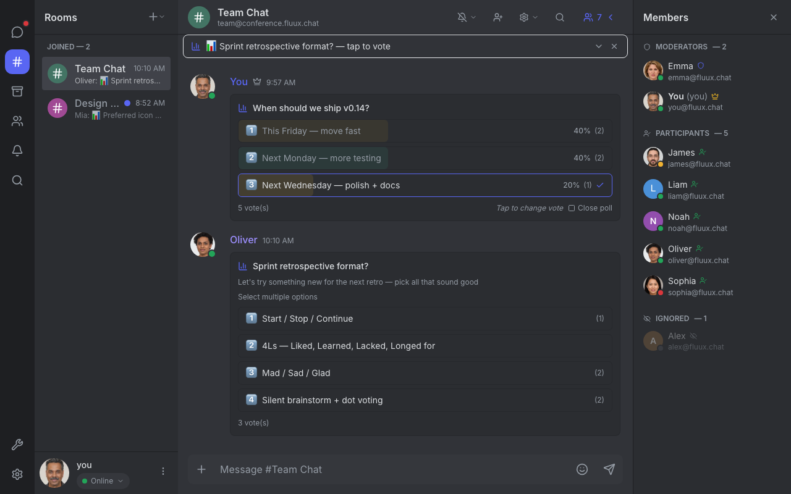
*[03-rooms-with-members.png](ux-review-screenshots/03-rooms-with-members.png),
[13-rooms-default.png](ux-review-screenshots/13-rooms-default.png) ·
`apps/fluux/src/components/RoomView.tsx`,
`apps/fluux/src/components/OccupantPanel.tsx`*

This view is one of the strongest in the app — the polls, the
moderator/participant grouping, and the inline ignored-users section all read
well at a glance.

| #   | Issue                                                                                                                                                                                                                                                                    | Recommendation                                                                                                                     | Sev | Eff |
|-----|--------------------------------------------------------------------------------------------------------------------------------------------------------------------------------------------------------------------------------------------------------------------------|------------------------------------------------------------------------------------------------------------------------------------|-----|-----|
| 5.1 | **Member panel toggle is at the far top-right of the chat header** (`👥 7 ›`), small and easy to miss. The shortcut isn't surfaced.                                                                                                                                      | Make the chip slightly larger and add a tooltip with the keyboard shortcut.                                                        | L   | S   |
| 5.2 | **Joining a room is buried.** From the Rooms tab there's a `+` icon at the top of the sidebar that opens a dropdown — no entry on the empty state, no entry from the global command palette, no entry from a contact's profile ("Invite to a room…").                    | Add a prominent "Join or create a room" CTA on the empty state of the Rooms tab. Already in command palette as a fallback.         | M   | S   |
| 5.3 | **No password-room or nickname-conflict UI captured** in the codebase walkthrough. JoinRoomModal collects JID + nickname only.                                                                                                                                           | Add password field that appears when the server returns `password-required`, and a nickname-conflict re-prompt on `conflict`.      | M   | M   |
| 5.4 | The poll card is excellent. The "Tap to change vote · Close poll" footer is a bit subtle — "Close poll" is a destructive action sitting next to a passive hint, with no separation.                                                                                      | Move "Close poll" into a kebab menu or behind a separate action. Risk: a moderator misclicks.                                      | M   | S   |
| 5.5 | The "Ignored" section in the member list (`Alex` in the screenshot) is rendered identically to other members but greyed out. **It's unclear from the visual whether "Ignored" is a state I set, or one set by a moderator** — the affordance to un-ignore isn't obvious. | Add a small "click to un-ignore" tooltip on the row, and a section header tooltip explaining the scope (per-user vs. server-wide). | L   | S   |

---

## 6. Directory (contacts)


*[04-directory-list.png](ux-review-screenshots/04-directory-list.png),
[05-directory-profile.png](ux-review-screenshots/05-directory-profile.png),
[12-directory-empty-detail.png](ux-review-screenshots/12-directory-empty-detail.png)*

| #   | Issue                                                                                                                                                                                                                                                                             | Recommendation                                                                                                                                                                 | Sev | Eff |
|-----|-----------------------------------------------------------------------------------------------------------------------------------------------------------------------------------------------------------------------------------------------------------------------------------|--------------------------------------------------------------------------------------------------------------------------------------------------------------------------------|-----|-----|
| 6.1 | **The "Add contact" entry point is hidden behind an icon-only dropdown** in the sidebar header (a `Users + ▾` button with no aria-label or visible text). New users will not find it.                                                                                             | Add an explicit `+ Add contact` button to the Connections sidebar header — the dropdown can stay for "blocked users" etc., but the primary action shouldn't be hidden.         | H   | S   |
| 6.2 | **The empty profile pane reads "Click on a contact to view their profile, connected devices, or start a conversation. Double-click to start a conversation directly."** The double-click hint is the kind of advanced shortcut that belongs in a tooltip, not in the empty state. | Drop the double-click line from the empty state; surface it as a tooltip on the contact row instead.                                                                           | L   | S   |
| 6.3 | The contact profile shows "CONNECTED DEVICES → Fluux · Online · Priority: 5 · desktop". **"Priority: 5" is meaningless to a non-XMPP user.**                                                                                                                                      | Either hide the priority unless a power-user mode is enabled, or replace the number with a relative term ("Primary device" if highest priority among the contact's resources). | L   | S   |
| 6.4 | "Block user" is rendered as a destructive red button **next to** "Remove from my contacts" (also red). They are distinct severity actions and should not look the same.                                                                                                           | Make "Remove from my contacts" a tertiary action (text button or kebab item); keep "Block user" prominent.                                                                     | M   | S   |
| 6.5 | No "Recent shared media" or "Files exchanged" panel on the contact profile — common ask from Signal/Telegram converts.                                                                                                                                                            | Add as a follow-up; SDK has the data via MAM.                                                                                                                                  | L   | M   |

---

## 7. Settings

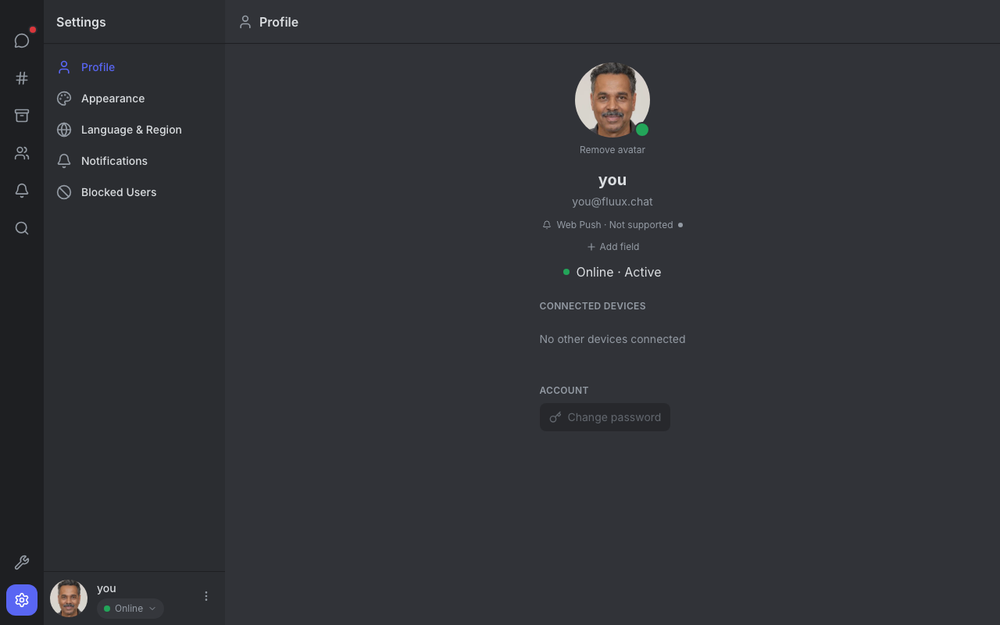
*[10-settings.png](ux-review-screenshots/10-settings.png),
[17-light-settings.png](ux-review-screenshots/17-light-settings.png) ·
`apps/fluux/src/components/SettingsView.tsx`*

| #   | Issue                                                                                                                                                                                                | Recommendation                                                                                                                                                  | Sev | Eff |
|-----|------------------------------------------------------------------------------------------------------------------------------------------------------------------------------------------------------|-----------------------------------------------------------------------------------------------------------------------------------------------------------------|-----|-----|
| 7.1 | **"Web Push · Not supported"** appears in the profile section with an orange dot and no further help. The user doesn't know why or what to do.                                                       | Either (a) hide the line on supported platforms, (b) link to a "What is web push?" docs anchor, or (c) on Tauri, replace with "Native notifications · Enabled". | M   | S   |
| 7.2 | **"Add field"** under the user's name — invites custom vCard fields, but the modal that opens isn't pre-populated with common suggestions (phone, website, role). Most users won't know what to add. | Pre-suggest 4-6 common fields on first click.                                                                                                                   | L   | S   |
| 7.3 | The settings sidebar lists Profile / Appearance / Language & Region / Notifications / Blocked Users — but **no "Encryption / Keys"** entry, even though the project has E2EE / OpenPGP scaffolding.  | Add "Encryption" once the OpenPGP-OX flow is user-facing. Out of scope for current state.                                                                       | —   | —   |
| 7.4 | **No search** within Settings. Five categories is borderline OK now, but with E2EE, devices, integrations, etc., a search box becomes valuable.                                                      | Add a search input above the category list when count > 6.                                                                                                      | L   | S   |
| 7.5 | The "Change password" button at the bottom is **pinned to the centre of the right pane** with empty space below — feels orphaned.                                                                    | Move into an "Account" section header alongside email/JID identity rather than free-floating.                                                                   | L   | S   |

---

## 8. Search

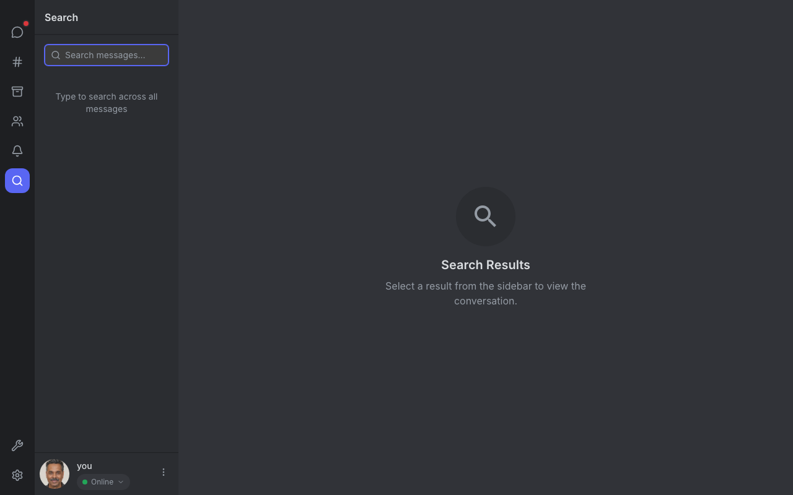
*[08-search-empty.png](ux-review-screenshots/08-search-empty.png) ·
`apps/fluux/src/components/SearchContextView.tsx`*

| #   | Issue                                                                                                                                                                                                                                         | Recommendation                                                                                | Sev | Eff |
|-----|-----------------------------------------------------------------------------------------------------------------------------------------------------------------------------------------------------------------------------------------------|-----------------------------------------------------------------------------------------------|-----|-----|
| 8.1 | **The empty state is split awkwardly:** the sidebar reads "Type to search across all messages" while the right pane shows "Search Results / Select a result from the sidebar to view the conversation." Two empty states for one empty state. | Show only the sidebar prompt; hide the right pane entirely until there's at least one result. | M   | S   |
| 8.2 | The search input is in the sidebar — fine. But there's **no global search shortcut surfaced** (the command palette `⌘K` exists, but the in-sidebar Search tab and `⌘F` "find on page" overlap conceptually).                                  | Add a keyboard hint chip in the empty state: "Tip: ⌘K to search anywhere".                    | L   | S   |
| 8.3 | The search input has no filters (date, sender, channel). For long histories this scales poorly.                                                                                                                                               | Defer; add date/sender filters once result counts justify.                                    | L   | M   |

---

## 9. Events / Activity log

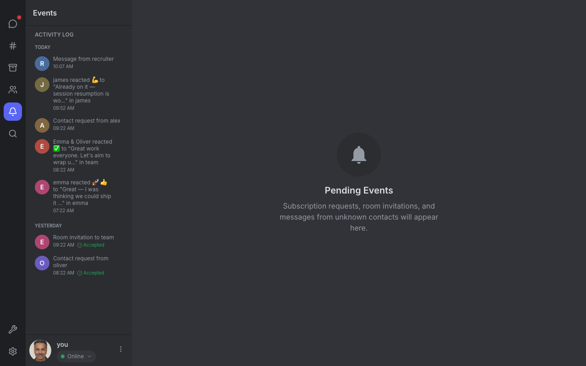
*[07-events.png](ux-review-screenshots/07-events.png) ·
`apps/fluux/src/components/ActivityContextView.tsx`*

| #   | Issue                                                                                                                                                                                                                                            | Recommendation                                                                                                                                                                                                             | Sev | Eff |
|-----|--------------------------------------------------------------------------------------------------------------------------------------------------------------------------------------------------------------------------------------------------|----------------------------------------------------------------------------------------------------------------------------------------------------------------------------------------------------------------------------|-----|-----|
| 9.1 | **Title mismatch:** sidebar reads "Events" / "ACTIVITY LOG", right pane reads "Pending Events / Subscription requests, room invitations, and messages from unknown contacts will appear here." The user has to reconcile two different framings. | Pick one term ("Activity") and apply consistently. The empty-state copy on the right should match what the sidebar list contains.                                                                                          | M   | S   |
| 9.2 | **Subscription requests are co-mingled with reaction logs.** "Contact request from alex" sits below "james reacted 💪 to ..." — the former needs the user's attention, the latter doesn't. The two have *very* different urgency.                | Split into two top-level groups: **Action required** (subscription requests, room invitations, mediated invites) at top, **Activity** (reactions, replies, mentions) below. Maintain a counter only for "action required". | H   | S   |
| 9.3 | Reactions are attributed: "emma reacted 🚀👍 to 'Great — I was thinking we could ship it...' in emma". The "in emma" suffix is awkward (lowercase, the same name twice).                                                                         | Render as: "Emma reacted 🚀👍 to your message in **#design**" or in 1:1: "Emma reacted 🚀👍 to a message you sent".                                                                                                        | L   | S   |
| 9.4 | Old accepted requests ("Accepted ✓") still show in the YESTERDAY group — clutter.                                                                                                                                                                | Auto-archive after 7 days; surface a "Show archived activity" toggle.                                                                                                                                                      | L   | S   |

---

## 10. Admin

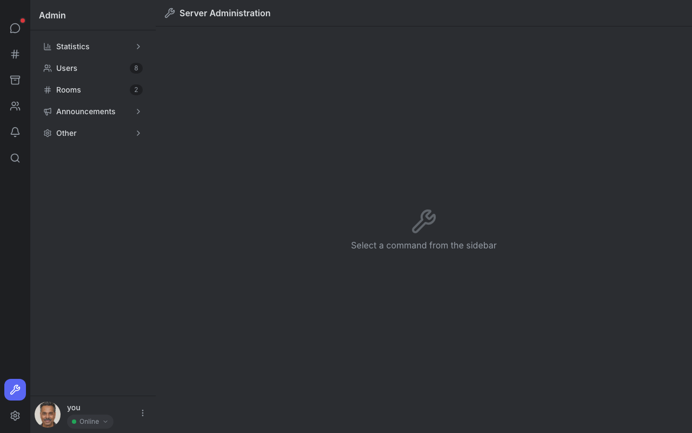
*[09-admin.png](ux-review-screenshots/09-admin.png) ·
`apps/fluux/src/components/AdminView.tsx`*

| #    | Issue                                                                                                                                                                                                         | Recommendation                                                                                                                                                                | Sev | Eff |
|------|---------------------------------------------------------------------------------------------------------------------------------------------------------------------------------------------------------------|-------------------------------------------------------------------------------------------------------------------------------------------------------------------------------|-----|-----|
| 10.1 | The **right pane is empty** with the prompt "Select a command from the sidebar". For a power-user surface this is a wasted opportunity.                                                                       | Replace the empty state with a server-status dashboard: connected users, server version, recent admin actions, common shortcuts (Add user / Create room / Send announcement). | M   | M   |
| 10.2 | The categories use icon + label + counter (`Users 8`, `Rooms 2`). The counters are great. But there is **no breadcrumb when navigating into Statistics > Users > emma@…** — the user has to use browser back. | Add a breadcrumb above the right-pane header.                                                                                                                                 | L   | S   |
| 10.3 | The "Other" category is a bucket. Anything that doesn't fit elsewhere goes here — fine for now but does not scale.                                                                                            | Defer; revisit when Other has > 6 commands.                                                                                                                                   | L   | S   |

---

## 11. Command palette

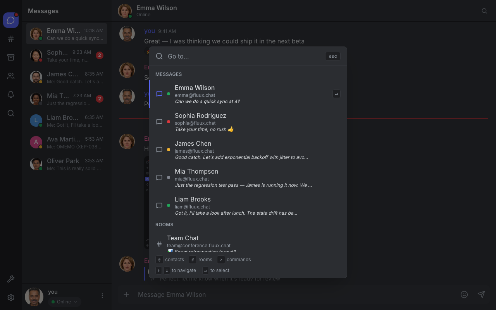
*[11-command-palette.png](ux-review-screenshots/11-command-palette.png)*

The palette is excellent: fuzzy-search across messages, contacts, rooms,
commands, with keyboard hints at the bottom (`↵ to navigate · → to select`).
This feature is competitive with Slack's `⌘K` and notably better than most
XMPP clients.

| #    | Issue                                                                                                                                                                                                | Recommendation                                                                                                   | Sev | Eff |
|------|------------------------------------------------------------------------------------------------------------------------------------------------------------------------------------------------------|------------------------------------------------------------------------------------------------------------------|-----|-----|
| 11.1 | **No surface advertising the shortcut.** There is no `⌘K` chip anywhere visible in the chrome. New users won't discover it.                                                                          | Add a small "search… ⌘K" chip near the user menu, or include the shortcut in the empty state of every list view. | M   | S   |
| 11.2 | The command palette currently surfaces messages, contacts, rooms, commands. **It doesn't surface settings** ("Change theme", "Set status to away").                                                  | Index settings actions into the palette. Builds on the existing slash-command infra.                             | L   | M   |
| 11.3 | Result groups are rendered with **subtle uppercase headers** (MESSAGES / ROOMS / COMMANDS). Slightly easier to scan if the group icon prefix matched the icon-rail icons (using `#` for rooms etc.). | Already uses `#` for rooms — good. Could use chat-bubble for messages.                                           | L   | S   |

---

## 12. Mobile / narrow viewport

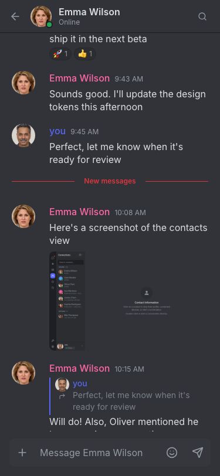
*[14-mobile-messages-list.png](ux-review-screenshots/14-mobile-messages-list.png),
[15-mobile-chat.png](ux-review-screenshots/15-mobile-chat.png)*

The 375 px experience is competent — sidebar collapses, chat takes the full
width — but a few rough edges:

| #    | Issue                                                                                                                                                                                                     | Recommendation                                                                                                                   | Sev | Eff |
|------|-----------------------------------------------------------------------------------------------------------------------------------------------------------------------------------------------------------|----------------------------------------------------------------------------------------------------------------------------------|-----|-----|
| 12.1 | **Chat header on mobile loses access to** members (rooms only), search, conversation settings. There's only `← Avatar Name 🔍` visible.                                                                   | Add a kebab menu on the right of the header that opens a mobile sheet with: View members · Mute · Block · Conversation settings. | M   | M   |
| 12.2 | **Composer toolbar shrinks** to `+ · placeholder · 😀 · ↗` — the attachment-preview/reply/edit features are hidden behind `+`. Acceptable for mobile but **the `+` button has no tooltip** explaining it. | Tooltip + a small "+" → "Attachments / GIF / Reply" sheet.                                                                       | L   | S   |
| 12.3 | The icon rail on mobile is the same width as desktop (~56 px) which feels too wide on a 375 px viewport — eats 15 % of horizontal space.                                                                  | Reduce the icon-rail width on `<sm` breakpoints; consider a bottom-tab pattern below 480 px.                                     | L   | M   |
| 12.4 | **No swipe gesture to go back** from chat → conversation list (only the `←` button).                                                                                                                      | Add `react-swipeable` left-edge swipe → close chat. Big mobile DX win.                                                           | M   | M   |
| 12.5 | The `New messages` divider does appear on mobile, but the floating "scroll to bottom" affordance is small and gets covered by the system home bar on iOS Safari.                                          | Apply existing `pb-safe` utility to the FAB position.                                                                            | L   | S   |

---

## 13. Light theme

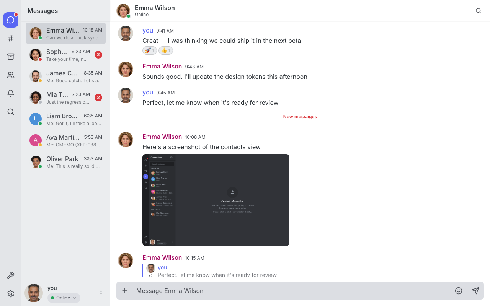
*[16-light-1to1.png](ux-review-screenshots/16-light-1to1.png),
[17-light-settings.png](ux-review-screenshots/17-light-settings.png)*

The light theme is well-executed; the 3-tier CSS variable token system
(documented in `apps/fluux/src/index.css:51-277`) makes the swap cohesive. Two
specific gaps:

| #    | Issue                                                                                                                                    | Recommendation                                                     | Sev | Eff |
|------|------------------------------------------------------------------------------------------------------------------------------------------|--------------------------------------------------------------------|-----|-----|
| 13.1 | **The composer's "Message Emma Wilson" placeholder looks slightly disabled** — its grey-on-light contrast is borderline against WCAG AA. | Bump placeholder colour to meet 4.5:1 (currently appears ≈ 3.5:1). | M   | S   |
| 13.2 | The "you" name colour (blue) and "Emma Wilson" name colour (pink) have **lower contrast in light theme** than dark.                      | Verify both pass AA at 16 px regular weight; deepen if not.        | L   | S   |

---

## 14. Cross-cutting observations

### 14.1 Component library debt (M · M)

There is no shared `<Button>`, `<Input>`, `<Modal>` primitive. Each modal
re-implements its own layout (header, body, footer, close button). Each button
re-implements `bg-fluux-brand hover:bg-fluux-brand-hover px-4 py-3 …`. This
works at the current scale but will produce visual drift as the team grows.

**Recommendation:** introduce a `components/ui/Button.tsx` with `variant`
("primary", "secondary", "danger", "ghost"), `size`, `loading` props; migrate
incrementally as files are touched. Same for `Input`, `Modal`. Don't pull in a
component library — Tailwind + a 4-primitive thin layer is sufficient and
keeps bundle size flat.

### 14.2 Accessibility (M · L)

Aria-labels are in place on ~40 buttons; semantic `<button>` is used
consistently; the `useFocusZones` hook manages focus regions. Gaps to close:

- Modals don't focus-trap on open — `Tab` can escape into the page below.
- No documented WCAG 2.1 AA audit; some colour pairs (light-theme placeholder,
  light-theme name colours) read borderline.
- The icon rail has tooltips but no labels — screen-reader users hear "button"
  with `aria-label="Messages"` etc. Verify each icon-rail button has a
  meaningful label.
- The `New messages` divider should announce itself politely
  (`role="status" aria-live="polite"`) for screen-reader users when new
  messages arrive while the thread is open.

A separate pass with axe-core or Lighthouse would catch the rest.

### 14.3 Motion (L · —)

Motion is judiciously used — `message-highlight`, `message-send`,
`reaction-burst`, `fab-spring-in/out`, the typing dots. No gratuitous
animation, no `Framer Motion` weight. Keep this discipline.

### 14.4 Feature flag / unfinished work

`UploadState` (`isUploading`, `progress %`) is defined in the SDK but the UI
layer renders no progress indicator. Either:

- (S) Render a thin progress bar at the bottom of the message bubble for the
  in-flight attachment, or
- (M) Render a row in a "Pending uploads" tray.

This is the single biggest discoverable gap between SDK capability and UI
surfacing.

### 14.5 Internationalisation

The app is i18n-aware (33 languages per `scripts/screenshots.ts`). The screenshots
above were captured with the demo locale forced to English (`__i18n.changeLanguage('en')`)
so labels read consistently. When the locale falls back to the user's OS preference
(observed during initial exploration), the empty-state pane reads "Conversations privées"
in French while the section header reads "Messages" in English — a missed translation key
rather than a UX defect. Worth a `grep -r 'untranslated'` plus a check that every
`<EmptyState>` consumer pulls its title from `t()`.

---

## 15. Suggested follow-up tickets

A copy-paste checklist for triage. Severity in brackets.

```
[ ] [H] Add reconnect/network-state banner above chat header — §4.1, §4.2
[ ] [H] Render sending/sent/failed states on outgoing messages — §2.1
[ ] [H] Persist composer drafts + pending attachments per conversation — §2.4
[ ] [H] Split Events into "Action required" + "Activity" — §9.2
[ ] [H] Promote "+ Add contact" out of the icon-only dropdown — §6.1
[ ] [H] Add registration / "find a server" path on LoginScreen — §1.1
[ ] [M] Label or auto-expand the icon rail (Discord/Slack pattern) — §3.2
[ ] [M] Apply unread/pending dot indicator consistently across tabs — §3.3
[ ] [M] Add "Start conversation" + "Join room" CTAs to empty Messages state — §3.5
[ ] [M] Floating "↓ N new" pill on the chat list — §2.3
[ ] [M] Read-receipts (XEP-0184) with double-checkmark on last message — §2.2
[ ] [M] Render upload progress UI tied to SDK's UploadState — §14.4
[ ] [M] Mobile: kebab menu in chat header for members/mute/settings — §12.1
[ ] [M] Mobile: left-edge swipe to go back — §12.4
[ ] [M] Server-status dashboard in Admin empty state — §10.1
[ ] [M] Server (optional) auto-expand on DNS lookup failure — §1.2
[ ] [M] Auto-expand Settings search when categories > 6 — §7.4
[ ] [M] Differentiate "Block user" from "Remove from contacts" — §6.4
[ ] [M] Light-theme placeholder + name colours WCAG AA pass — §13.1, §13.2
[ ] [M] Settings: "Web Push · Not supported" needs context or hide — §7.1
[ ] [M] Conversation list: move unread badge onto avatar — §3.1
[ ] [M] Surface ⌘K shortcut in chrome — §11.1
[ ] [M] Conversation list: drop "Moi:" prefix for a glyph — §3.4
[ ] [M] Reply quotes: scroll-to-source on click + highlight — §2.6
[ ] [L] Introduce `<Button>` / `<Input>` / `<Modal>` primitives — §14.1
[ ] [L] Modal focus trap + keyboard-shortcut docs — §14.2
[ ] [L] Hide priority number / replace with "Primary device" — §6.3
[ ] [L] Settings: "Add field" pre-suggest common vCard fields — §7.2
[ ] [L] Reaction tooltip: who reacted — §2.5
[ ] [L] Composer send button: accent when input non-empty — §2.7
[ ] [L] Login: validate JID shape locally — §1.4
[ ] [L] Admin: add breadcrumb when navigating into a category — §10.2
[ ] [L] Events: archive accepted activity items after 7 days — §9.4
[ ] [L] Search: surface filters once result counts justify — §8.3
[ ] [L] Index settings actions into command palette — §11.2
```

---

## Methodology & limits of this review

- All findings were grounded against the source files cited (exact path next
  to each section header). No claim is made about behavior that was not
  visible in the captured screenshots or readable in code.
- Demo mode (`/demo.html`) is a fake-data harness — it cannot exhibit
  network-level behavior (real reconnect, real MAM latency, real
  large-attachment uploads). Findings about those flows lean more heavily on
  code reading; verify with a real ejabberd before implementing fixes.
- The review intentionally did not run an axe-core / Lighthouse pass — that's
  a separate, complementary effort.
- Severity / Effort calls are best-effort and assume one experienced engineer
  familiar with the codebase. Adjust against your team's actual capacity.
- Screenshots can be regenerated by running `npm run ux:audit`
  (`scripts/ux-screenshots.ts` + `playwright.ux.config.ts`). Re-run before
  drafting a follow-up audit so findings stay grounded in the current build.
